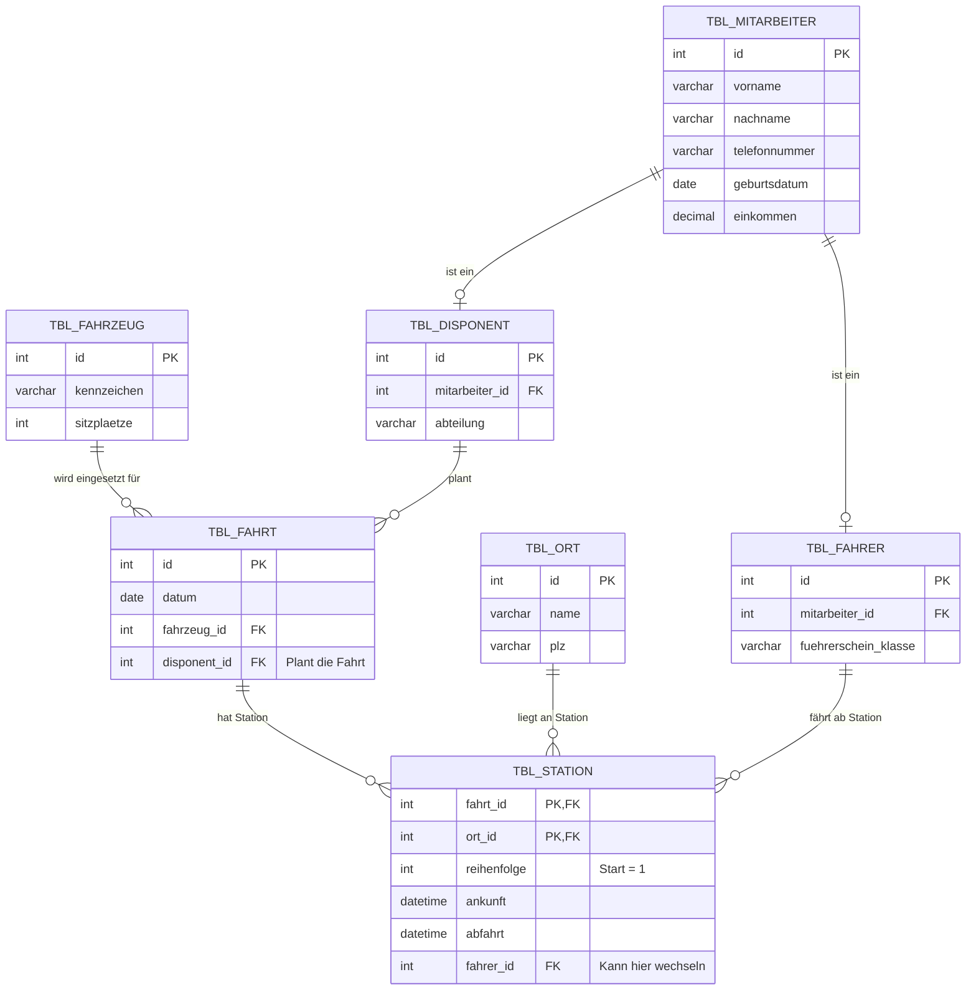

# Lösung: Tourenplaner (Tag 1 & 2)

## Aufgabenstellung
*Ein Busunternehmen beschäftigt Disponenten und Fahrer. Die Disponenten planen und organisieren die Fahrten. Eine Fahrt hat mehrere Stationen, wobei Orte nur einmal angefahren werden dürfen. An jeder Station kann der Fahrer wechseln. Pro Station kann eine Ankunfts- und eine Abfahrtszeit erfasst werden, wobei für die Start-Station nur Abfahrtszeit erfasst wird und für die Ziel-Station nur die Ankunftszeit. Fahrer und Disponenten sind über Telefon erreichbar. Jeder Fahrt wird jeweils ein Fahrzeug zugeordnet, welches eine gewisse Anzahl Sitzplätze zur Verfügung stellt.*

*(Hinweis: Laut Aufgaben aus Tag 2.Tag/README.md sollen Fahrer und Disponent zu einem übergeordneten Entitätstyp zusammengefasst werden: der Generalisierung `tbl_Mitarbeiter`.)*

## Logisches Datenmodell (ERD) mit Generalisierung
Die gemeinsame `tbl_Mitarbeiter` (Supertyp) enthält allgemeine Personendaten, während `tbl_Fahrer` und `tbl_Disponent` (Subtypen) spezifische Eigenschaften erben (1:1 bzw. 1:c Beziehung).

### Erklärung der Struktur:
- **Generalisierung:** `TBL_MITARBEITER` hält alle redundanten Felder (Name, Telefon). `TBL_FAHRER` und `TBL_DISPONENT` verweisen über ihren Fremdschlüssel (`mitarbeiter_id`) darauf.
- **Fahrt:** Wird von genau einem Disponenten geplant und nutzt ein konkretes Fahrzeug.
- **Station:** Löst die *m:n*-Beziehung zwischen einer `TBL_FAHRT` und einem `TBL_ORT` auf. Da sich Fahrer pro Station abwechseln können, wird die `fahrer_id` als Fremdschlüssel an der Station (und nicht direkt in der Fahrt) hinterlegt. Ankunfts- und Abfahrtszeiten werden ebenfalls hier festgehalten.
