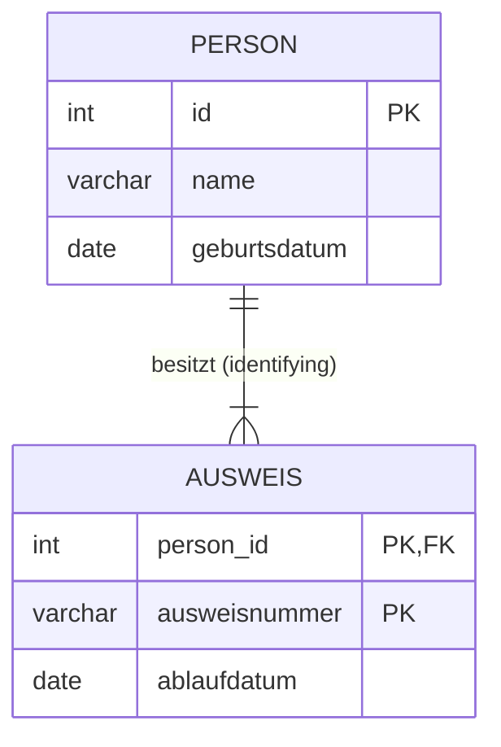
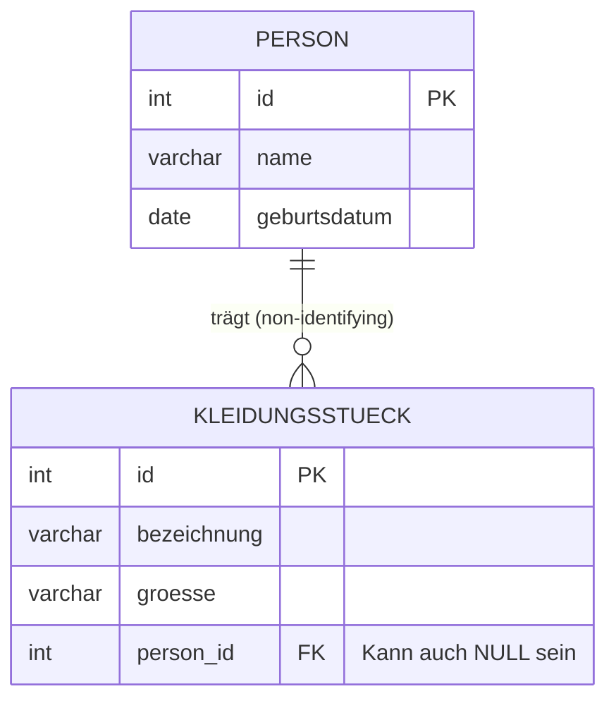

# Lösung: Identifying vs. Non-Identifying Relationship (Tag 2)

## 1. Identifying Relationship (UML Komposition)
*Regel: Der Fremdschlüssel (FK) der Kind-Tabelle ist gleichzeitig ein Teil ihres Primärschlüssels (PK).*
Das bedeutet: Der Datensatz der Kind-Tabelle kann **nicht exisiteren**, ohne den Datensatz der Eltern-Tabelle zu identifizieren.

**Beispiel: Person und Ausweis**
Ein Ausweis ohne eine Person ist völlig wertlos und von seiner Definition her unmöglich. Die `person_id` ist essenzieller Bestandteil der Identifikation des `ausweis`-Datensatzes.

---

## 2. Non-Identifying Relationship (UML Aggregation)
*Regel: Der Fremdschlüssel (FK) der Kind-Tabelle ist **nicht** Teil des Primärschlüssels (PK).*
Das bedeutet: Der Datensatz der Kind-Tabelle hat eine **eigene, unabhängige Identität**, auch wenn er einer anderen Tabelle zugeordnet ist.

**Beispiel: Person und Kleidungsstück (wie im Unterrichts-Thema angesprochen)**
Ein Kleidungsstück kann auch *ohne* Person existieren (z.B. ungetragen im Schrank oder als neu produziertes Hemd) oder den Besitzer wechseln. Die Person identifiziert das Kleidungsstück nicht elementar.

