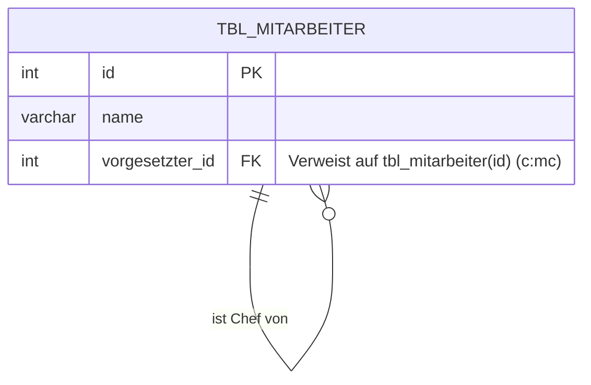
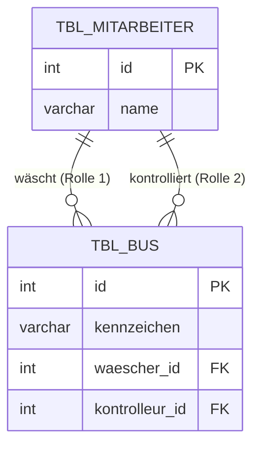

# Lösung: Datentypen und Hierarchien (Tag 3)

## 1. Tabelle Datentypen vervollständigt (MariaDB / MySQL)

| Datentyp | MariaDB (MySQL) | Beispiel | Bemerkung / Einstellungen |
|----|----|----|----| 
| Ganze Zahlen | INT / INTEGER | INT(11)   2147483647 | Vorzeichenbehaftet (SIGNED) oder vorzeichenlos (UNSIGNED). Weitere: TINYINT, SMALLINT, MEDIUMINT, BIGINT. |
| Natürliche Zahlen | INT UNSIGNED | INT UNSIGNED   4294967295 | Keine negativen Zahlen, positiver Bereich verdoppelt sich. |
| Festkommazahlen   (Dezimalzahlen) | DECIMAL(M,D) | DECIMAL(6,2)   1234.56 | M = Gesamte Anzahl Stellen (Precision)   D = Nachkommastellen (Scale) |
| Aufzählungstypen | ENUM | ENUM('M', 'F', 'D') | Nur einer der vordefinierten Werte kann gespeichert werden. Speichert intern als Integer (1, 2, 3). |
| Boolean (logische Werte) | BOOLEAN / TINYINT(1) | TRUE oder FALSE   (1 oder 0) | MariaDB / MySQL behandelt BOOLEAN als Synonym für TINYINT(1). Null (0) = FALSE, Werte ungleich Null = TRUE. |
| Zeichen (einzelnes Zeichen) | CHAR | CHAR(1)   'Y' | Zeichenkette fester Länge. Bei CHAR(1) ist es exakt ein Zeichen. |
| Gleitkommazahlen | FLOAT / DOUBLE | FLOAT(10,4)   12.3456 | Annäherungswerte. FLOAT (einfache Genauigkeit, 4 Byte), DOUBLE (doppelte Genauigkeit, 8 Byte). |
| Zeichenkette fester Länge | CHAR(M) | CHAR(10)   'Hallo     ' | Speicherplatz immer M Bytes, auch wenn der String kürzer ist; wird mit Leerzeichen aufgefüllt. |
| Zeichenkette variabler Länge | VARCHAR(M) | VARCHAR(255)   'Hallo Welt' | Spart Platz: Verbraucht nur so viele Bytes wie der String hat + 1 oder 2 Bytes Längenangabe. M = Maximallänge. |
| Datum und/oder Zeit | DATE / TIME / DATETIME | DATE   '2023-12-31' | DATETIME hat in der Regel das Format 'YYYY-MM-DD HH:MM:SS'. |
| Zeitstempel| TIMESTAMP | TIMESTAMP | Wird oft für Änderungsdaten genutzt, aktualisiert sich auf Wunsch automatisch mit CURRENT_TIMESTAMP. |
| Binäre Datenobjekte   variabler Länge (Bild)| BLOB | (Bilddatei) | Binary Large Object. Wird für binäre Strings verwendet. (TINYBLOB, BLOB, MEDIUMBLOB, LONGBLOB) |
| Verbund | SET | SET('a', 'b', 'c') | Eine Kombination aus 0 oder mehr vordefinierten Werten. Speichert max. 64 Elemente als Bitmaske intern. |
| JSON | JSON | `{"key": "value"}` | Ab MariaDB 10.2 / MySQL 5.7 nativer Datentyp. Bietet automatische Validierung und Funktionen (Extract etc.). |

## 2. Mehrfachbeziehungen und Hierarchien im Tourenplaner
*Ein Disponent teilt Fahrer ein, organisiert Touren und hat einen Chef (`tbl_mitarbeiter` rekursiv, "Einfache Hierarchie"). Disponenten haben zusätzlich andere Rollen (Mehrfachbeziehung).*

### Mermaid-Visualisierung: Rekursion ("Ein Mitarbeiter hat max. 1 Vorgesetzten")
In einer klassischen, strengen Unternehmensorganisation verweist ein Fremdschlüssel (`vorgesetzter_id`) auf den Primärschlüssel der *eigenen* Tabelle (`id`).

### Mermaid-Visualisierung: Mehrfachbeziehung (Rollen)
Zwischen denselben Tabellen bestehen *unabhängige* Beziehungen. Beispielsweise: **Ein Mitarbeiter (z.B. ein Fahrzeugwäscher) kann als "Wäscher" oder als "Kontrolleur" eines Busses arbeiten.** `TBL_BUS` hat zwei Fremdschlüssel auf die Mitarbeiter-Tabelle.

