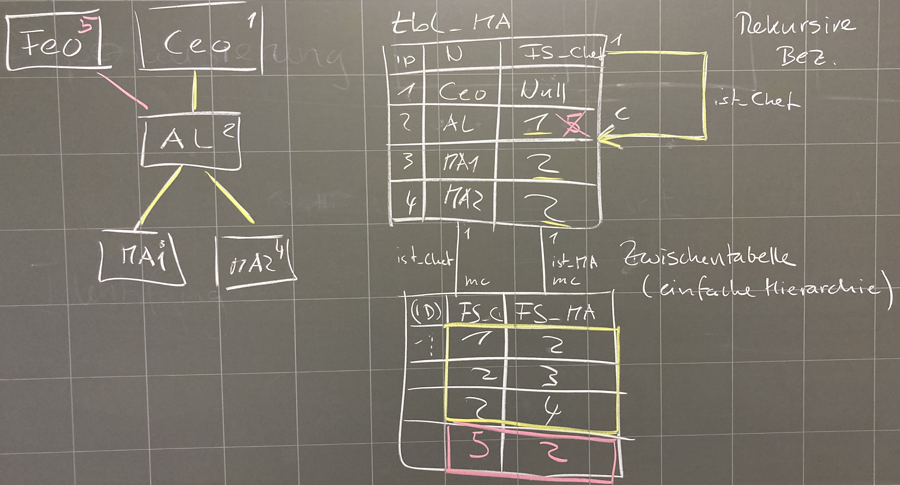

# M164 Lösungen 3.Tag

### Welche Schwierigkeiten beim Einfügen von Daten ergeben sich? 
   
   - Wenn beim `FS_CHEF` `Not Null` gesetzt ist, können Sie den CEO Biber nicht eintragen (wäre `NULL`).
   - Die Daten müssen in zwei Schritten eintragen werden: 1. Mitarbeiter mit `FS_Chef` --> `NULL`, 2. FS_Chef jeweils einzeln setzen. Die FS_Chef Werte existieren evtl. noch nicht als ID! 
   - Rekursive Hierarchie: Mitarbeiter die ihre eigenen Chefs sind können nicht eingetragen werden. Ebenso keine zwei Chefs! 
   - Hierarchie mit Zwischentabelle: Alle Beziehungen sind eingebbar! Zuerst die MA einpflegen, dann die Beziehungen.
   - Immer zuerst die sog. Stamm-Daten eingeben - das sind diejenigen ohne Fremdschlüssel - dann jene mit Bezug auf diese Stammdaten.

### Warum ist der Wert `NULL` in der `tbl_Hierarchie` nicht zulässig? *

   - In der Zwischentabelle dürfen keine `NULL`-Werte stehen, da sie eine **1**:m(c)-Beziehung haben!  

### Wann *muss* eine Hierarchie-Tabelle anstelle einer rekursiven Beziehung eingesetzt werden? 

- Siehe oben: Wenn es mehrere Chefs gibt!

