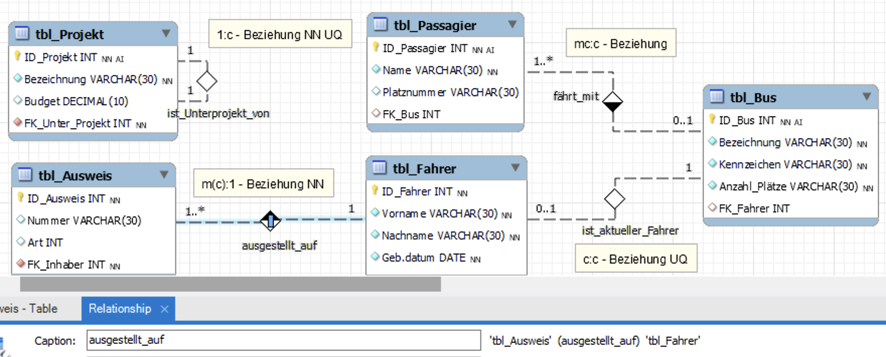
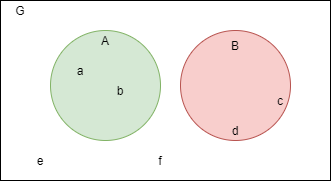
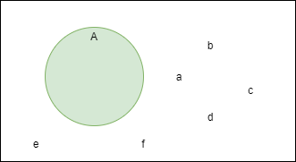
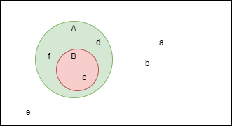
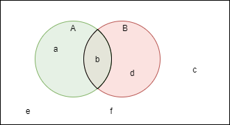
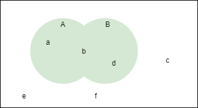
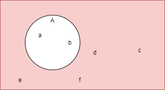
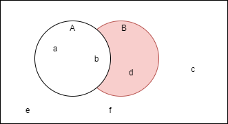
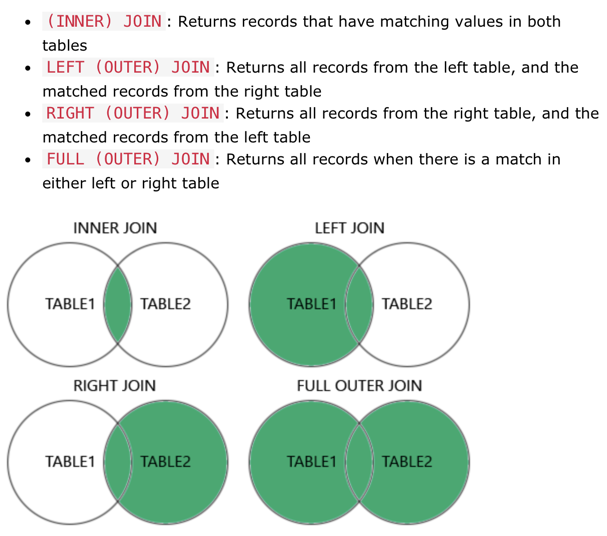

√


# m164 - Datenbanken erstellen und Daten einfügen

[TOC]

---

# Tag 4

>  <br> Recap / Q&A Tag 3  <br>
> [Lösung 3.Tag](3T_Loes.md)


## Beziehung mit Einschränkung (constraint) erstellen


 <br> Im logischen und physischen Datenmodell sind die Beziehungen der relationalen Datenbank aufgrund der möglichen Einstellungen (constraints) der Fremdschlüssel eingeschränkt!

Folgende Beziehungen können im physischen Modell realisiert werden:

| Beziehung <br> *MasterTab.links : DetailTab.rechts* | möglich | **nicht möglich<sup>1</sup>** &#10132; wird zu | Constraints FK |
|-----------|---------|---------------------------|-------------|
|eins zu eins <br>  | 1:c <br> c:c | **1:1** &#10132; 1:c <br> -| NN UQ <br> -- UQ |
|eins zu viele <br>  | 1:mc <br> c:mc | **1:m** &#10132; 1:mc <br> **c:m** &#10132; c:mc| NN -- <br> -- -- |
|viele zu viele <br> nur via Transformationstabelle |  | **m:m, m:mc, mc:m, mc:mc** <br> &#10132; 1:mc-[TT]-mc:1 | - <br> NN -- & NN -- |

> <sup>1</sup>Gewisse Beziehungen, die der Kunde wünscht, können in einem RDBMS also nicht realisiert werden. Bzw. sie können nicht *genau* realisiert werden, sondern je nach Fall wird 1 zu c und in jedem Fall wird m zu mc, siehe Tabelle oben.
Damit den Kundenwünschen trotzdem entsprochen werden kann, müssen die Regeln via Applikation (z.B. GUI) sichergestellt werden. Das ist aber nicht Bestandteil dieses Moduls. 

### Forward Engineering


Wir wollen nun untersuchen, wie Workbench die DDL-SQL-Befehle für die vier möglichen Beziehungstypen erzeugt! 

1. Laden Sie die Datei [BeziehungenLE.mwb](../Daten/BeziehungenLE.mwb) herunter und öffnen Sie diese mit Workbench.
2. Lesen Sie das unten angezeigte ERD und analysieren Sie die Tabellen und Beziehungen. Setzen Sie das Häkchen in den *Preferences>Modeling>Diagram>Show Caption*
3. Erstellen Sie die vier angegebenen Beziehungen und setzen Sie die Einschränkungen `NN` und `UQ` (constraints) der Fremdschlüssel gemäss obiger Tabelle richtig. <br> 
4. Erzeugen Sie mittels Forward Engineering das DDL-SQL-Script und speichern Sie es ab.

> Hinweis: Die Rolle/Bezeichnung der Beziehung kann in Workbench durch einen Eintrag im **Relationship>>Caption** Feld erfolgen!

### Analyse (Partnerarbeit)

**Zu jedem Fremdschlüssel mit richtig gesetzten NN/UQ-Constraints wird zusätzlich ein "Constraint" erzeugt. Dies ist eine *Einschränkung*, die bei jedem Einfügen die FS-Daten auf deren Richtigkeit überprüft und somit die [ref. Integrität](https://www.datenbanken-verstehen.de/datenmodellierung/referentielle-integritaet/) sicherstellt!**

Untersuchen Sie das erzeugte Script und beantworten Sie folgende Fragen:

1. Wie wird beim Fremdschlüssel der Constraint `NOT NULL` erstellt?
2. Weshalb wird für jeden Fremdschlüssel ein Index erstellt? Lesen Sie [hier](https://www.datenbanken-verstehen.de/datenmodellierung/datenbank-index/)!
3. Wie wird der Constraint `UNIQUE` für einen Fremdschlüssel im Workbench mit Forward Engineering erstellt?
4. Beachte: Jede Beziehung wird auch mit einer Beziehungs-Überprüfung (Constraint ...) versehen. Erstellen Sie eine allgemeine Syntax für die `CONSTRAINT`-Anweisung.


> Hinweis: Anstelle des UNIQUE-Index kann nur der Fremdschlüssel auf `UNIQUE` gesetzt werden: <br> `FK_Fahrer INT UNIQUE;`. 

---

>  <br> Die vier Beziehungstypen im logischen und physischen Modell. Contraint als Überprüfungsautomation der ref. Integrität!

<br>


---


## Ergänzung ALTER TABLE tbl ADD CONSTRAINT <...> FOREIGN KEY (...

Mit ALTER TABLE können Fremdschlüssel-Constraints manuell auch nachträglich eingefügt werden.  

Fremdschlüssel hinzufügen:

```sql
ALTER TABLE <DetailTab>
  ADD CONSTRAINT <Constraint> FOREIGN KEY (<Fremdschlüssel>)
  REFERENCES <MasterTab> (<Primärschlüssel>);
```

| `<Wert>` | Erklärung |
|---|---| 
| `<DetailTab>` | Name der Detailtabelle |
| `<Constraint>` | Frei definierbarer Name. Mögliche Namenskonvention: FK\_Detailtabelle\_Mastertabelle, z.B. FK\_Autoren\_Ort. |
| `<Fremdschlüssel>` | Name des Fremdschlüsselattributes der Detailtabelle |
| `<MasterTab>` | Name der Master-/Primärtabelle |
| `<Primärschlüssel>` | Name des Primärschlüsselattributes der Master-/Primärtabelle |


Eindeutiger, einmaliger Schlüssel hinzufügen (z.B. darf jeder Fremdschlüsselwert max. 1x vorkommen):


```sql
ALTER TABLE <Tabelle>
  ADD UNIQUE (<FS_Name>); 
```


### Vertiefung:


 *Zeit: ca. 30 Min*

- Fügen Sie ein paar Daten in die Tabellen `tbl_Passagier`, `tbl_Bus`, `tbl_Fahrer` und `tbl_Ausweis` ein und überprüfen Sie die Beziehungen. Beachten Sie, dass Sie zuerst die Master-Tabelle füllen müssen, bevor Sie in der Detailtabelle FK-Werte setzen können! 
- Was geschieht, wenn Sie bei der 1:mc Beziehung `tbl_Ausweis` den FS-Wert `NULL` eingeben? Oder einen FS-Wert, der als PK-Wert nicht existiert?
- Fügen Sie ein paar Daten in die Tabellen `tbl_Projekt` ein. Möglich? Was müsste gändert werden?  *(Tipp siehe Tag 3 rekursive Beziehung)*


---

# Mengenlehre


Eine kurze [Einführung (YouTube 30min)](https://www.youtube.com/watch?v=AvVq2TfGQlg), falls euch das Thema nicht mehr geläufig ist (Stoff aus der Sekundarstufe).

## Symbole und Zeichen der Mengenlehre

| Symbol | Beschreibung |
| ------ | ------------ |
| Gross- und Klein-Buchstaben und ∈, ∉ | Grossbuchstaben bezeichnen eine **Menge**. Im Beispiel unten gibt es die drei Mengen *G* (Grundmenge), *A* und *B*. <br />  Kleinbuchstaben bezeichnen **Elemente**, welche einer Menge zugewiesen sind (zumindest der Grundmenge)<br><br>G={a,b,c,d,e,f}, A={a,b}, B={c,d} <br><br>∈ zeigt, dass ein Elemente in einer Menge enthalten ist, zum Beispiel: <br> *a ∈ A*, *b ∈ A* oder *d ∈ B*<br />∉ zeigt, dass ein Element in einer Menge nicht enthalten ist, zum Beispiel: <br> *a ∉ B* oder *d ∉ A*<br /> |
| {} oder Ø | Bezeichnet eine **leere Menge**. Im folgenden Beispiel ist die Menge *A* leer. <br>A={}<br /> |
| ⊂, ⊆   | ⊂ oder ⊆ bedeutet **Teilmenge** von. zum Beispiel: <br> *B ⊂ A*<br />Dies ist der Fall, wenn eine Menge komplett in einer anderen Menge enthalten ist.<br> <br />Für ein Element *x* bedeutet dies, dass wenn *x ∈ B* **auch** *x ∈ A* ist.<br /> <br /><br />**Achtung**: Es gibt einen Unterschied zwischen den beiden Zeichen, den wir hier aber ignorieren (echte und unechte Teilmengen). |
| ∩      | ∩ bezeichnet die **Schnittmenge** zwischen zwei Mengen, zum Beispiel: <br> *A ∩ B*. <br> Wenn zwei Mengen sich nicht überlagern, ist die Schnittmenge die leere Menge.<br /><br>Für ein Element *x* bedeutet dies, dass *x ∈ B* **und** *x ∈ A* ist.<br /> |
| ∪      | ∪ bezeichnet die **Vereinigungsmenge** von zwei Mengen, zum Beispiel: <br> *A ∪ B*. <br> Die beiden Mengen müssen sich nicht überlagern.<br /><br>Für ein Element x bedeutet dies, dass *x ∈ A* **oder** *x ∈ B* ist.<br /> |
| X<sup>c</sup>    | X<sup>c</sup> bezeichnet die **Komplementärmenge**, also alle Elemente, die nicht in der Menge X enthalten sind, zum Beispiel: <br> A<sup>c</sup> (alle Elemente im rot markierten Bereich).<br /><br> Für ein Element x bedeutet dies, dass *x ∈ G* **und** *x ∉ A* ist.<br /> |
| \ | \ bezeichnet die **Differenzmenge** zwischen zwei Mengen, zum Beispiel <br> *B\A*. <br> Es gehören alle Elemente dazu, die in der Menge B enthalten sind, aber nicht in der Menge A. <br><br> Für ein Element x bedeutet dies, dass *x ∈ B* **und** *x ∉ A* ist.<br /> |

Wenn wir im Folgenden SELECT-Befehle über mehrere Tabellen absetzen wollen, dann müssen wir die obig erklärten Schnittmengen verstehen. Die Mengen `A` und `B` entsprechen den Tabellen `TABLE1` und `TABLE2`, die Elemente sind dann die darin enthaltenen Datensätze.



### Auftrag


 *Zeit: 30min Form: 2er Team*

Setzen Sie den [Auftrag Mengenlehre](./Auftrag_Mengenlehre.md) um.


---


# SELECT JOIN (Repetition DQL ÜK Modul 106)


> Für diejenigen, die den ÜK noch nicht hatten: [SELECT JOIN Präsentation](./select-joins-intro.pdf) und [SELECT JOIN Befehle](./DQL_SEL_JOIN_Intro.md). <br> [SQL Joins you MUST know! (Animated + Practice)](https://www.youtube.com/watch?v=Yh4CrPHVBdE)

### Aufträge DQL


 *Zeit: 30min Form: 2er Team*

1. Setzen Sie den [Auftrag SELECT JOIN](Auftrag_select_join.md) um.
2. Setzen Sie den [Auftrag SELECT JOIN für Fortgeschrittene](Auftrag_select_join_Fortgeschrittene.md) um.

 Ablage im Lernportfolio (Scripte und Resultate)


---


#### Checkpoint

- **Ref. Integrität**: Was ist das? Machen Sie ein Beispiel dazu!
- Welche **Constraints** kann eine Beziehung haben? *(Tipp: Mehr als eine!)*
- Was ist der Unterschied zwischen `LEFT JOIN` und `RIGHT JOIN`?
- Wie wird eine **1:1**-Beziehung und eine **c:m**-Beziehung umgesetzt? Warum?
- Was ist der Nachteil, wenn eine Beziehung *nur* mit Primär- und Fremdschlüssel definiert werden, d.h. ohne die `Constraint`-Anweisung?
- Welche Folge hat einen Eintrag eines Fremdschlüsselwertes, der als ID-Wert in der verbundenen Tabelle nicht vorhanden ist? <br> a) *mit* Constraint-Anweisung auf dem FS <br> b) *ohne* Constraint-Anweisung auf dem FS


---


## Referenzen

