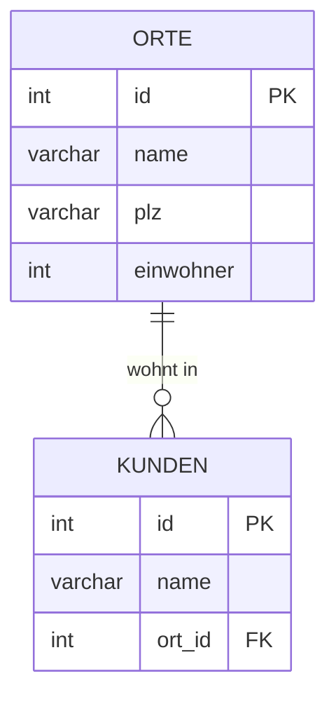

# Lösungen: Select join

## 1. Kartesisches Produkt
**Frage:** Erklären Sie in eigenen Worten, warum diese Abfrage kein sinnvolles Ergebnis gibt:
```sql
SELECT * FROM kunden
INNER JOIN orte;
```
**Antwort:** Bei diesem INNER JOIN fehlt die `ON`-Bedingung (welches Feld der einen Tabelle zu welchem Feld der anderen passt). Daher wird jeder Datensatz der Tabelle `kunden` mit jedem Datensatz der Tabelle `orte` kombiniert (Kreuzprodukt bzw. kartesisches Produkt). Dadurch entstehen unsinnige Kombinationen (z.B. jeder Kunde wird jedem existierenden Ort zugewiesen), was zu einer inkorrekten und extrem großen Ergebnismenge führt.

## 2. Einfache Abfragen über zwei Tabellen

**(Hinweis: Es wird davon ausgegangen, dass die Tabellen über eine `ort_id` oder ähnliches referenziert werden. Passe die Fremdschlüssel (`k.ort_id`) ggf. an das exakte Datenbankschema an.)**



**a) Geben Sie Name, Postleitzahl und Wohnort aller Kunden aus.**
```sql
SELECT k.name, o.plz, o.name AS ortname 
FROM kunden k
JOIN orte o ON k.ort_id = o.id;
```

**b) Geben Sie Name und Wohnort aller Kunden aus, die die Postleitzahl 79312 haben.**
```sql
SELECT k.name, o.name AS ortname 
FROM kunden k
JOIN orte o ON k.ort_id = o.id 
WHERE o.plz = '79312';
```

**c) Geben Sie Name und Wohnort aller Kunden aus, die in Emmendingen wohnen.**
```sql
SELECT k.name, o.name AS ortname 
FROM kunden k
JOIN orte o ON k.ort_id = o.id 
WHERE o.name = 'Emmendingen';
```

**d) Geben Sie Name, Wohnort und Einwohnerzahl für alle Kunden aus, die in einem Ort mit mehr als 70000 Einwohnern wohnen.**
```sql
SELECT k.name, o.name AS ortname, o.einwohner 
FROM kunden k
JOIN orte o ON k.ort_id = o.id 
WHERE o.einwohner > 70000;
```

**e) Geben Sie alle Orte aus, die weniger als 1000000 Einwohner haben.**
```sql
SELECT * 
FROM orte 
WHERE einwohner < 1000000;
```

**f) Geben Sie Kundename und Ortname aus für alle Kunden, die in Orten mit einer Einwohnerzahl zwischen 100.000 und 1.500.000 leben.**
```sql
SELECT k.name, o.name AS ortname 
FROM kunden k
JOIN orte o ON k.ort_id = o.id 
WHERE o.einwohner BETWEEN 100000 AND 1500000;
```

**g) Geben Sie Kundename, Postleitzahl und Ortname aus für alle Kunden, deren Name ein "e" enthält und alle Orte, die ein "u" oder ein "r" enthalten.**
```sql
SELECT k.name, o.plz, o.name AS ortname 
FROM kunden k
JOIN orte o ON k.ort_id = o.id 
WHERE k.name LIKE '%e%' 
  AND (o.name LIKE '%u%' OR o.name LIKE '%r%');
```
