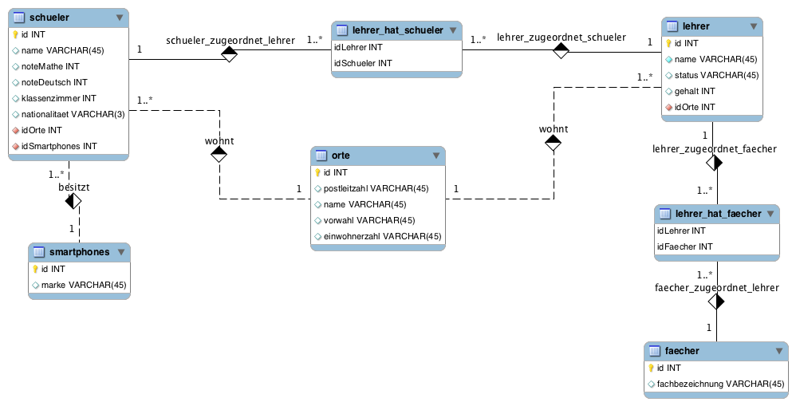

# Auftrag Aggregatsfunktionen

Gegeben ist die Datenbank [uebungSchuleDB](../Daten/uebungSchuleDB.sql). 

# Aufgaben

1.  Welches ist das niedrigste/höchste Gehalt eines Lehrers?
2.  Was ist das niedrigste Gehalt, das einer unserer Mathelehrer bekommt?
3.  Was ist der beste Notendurchschnitt der beiden Noten Deutsch und Mathe (z.B. Deutsch: 5 und Mathe: 4 -> Durchschnitt: 4.5)?
4.  Wie viel Einwohner hat der Ort mit den meisten Einwohnern, wie viel der Ort mit den wenigsten? Ausgabe "Höchste Einwohnerzahl", "Niedrigste Einwohnerzahl"
5.  Wie groß ist die Differenz zwischen dem Ort mit den meisten und dem mit den wenigsten Einwohnern (z.B.: kleinster Ort hat 1000 Einwohner, größter Ort hat 3000 - Differenz ist 2000). Ausgabe einer Spalte "Differenz".
6.  Wie viele Schüler haben wir in der Datenbank?
7.  Wie viele Schüler haben ein Smartphone?
8.  Wie viele Schüler haben ein Smartphone der Firma Samsung oder der Firma HTC?
9. Wie viele Schüler wohnen in Waldkirch?
10. Wie viele Schüler, die bei Herrn Bohnert Unterricht haben, wohnen in Emmendingen?
11. Wie viele Schüler unterrichtet Frau Zelawat?
12. Wie viele Schüler russischer Nationalität unterrichtet Frau Zelawat?
13. Welcher Lehrer verdient am meisten? (Achtung: Falle! Überprüfen Sie Ihr Ergebnis.)
