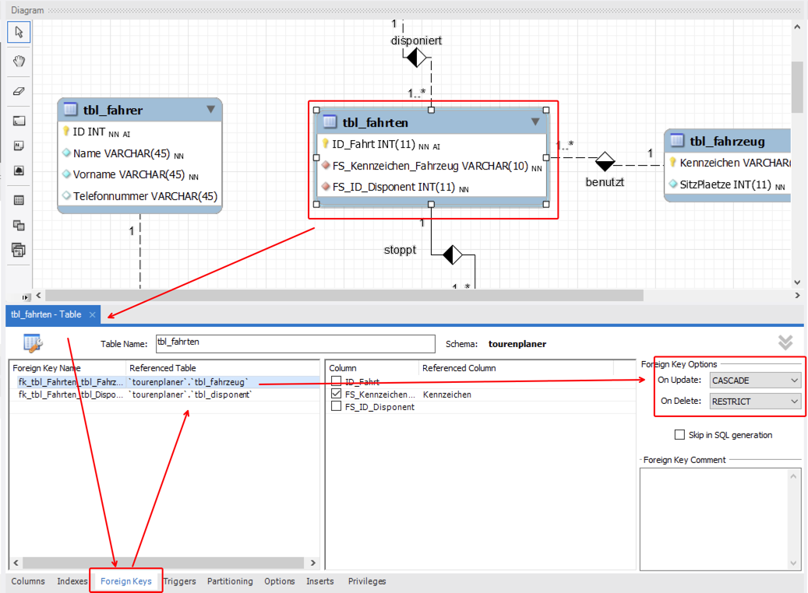
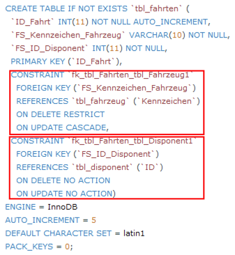
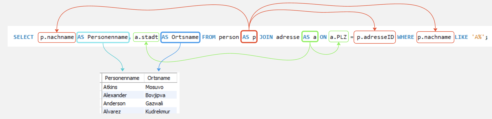
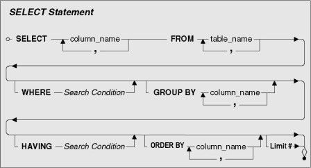
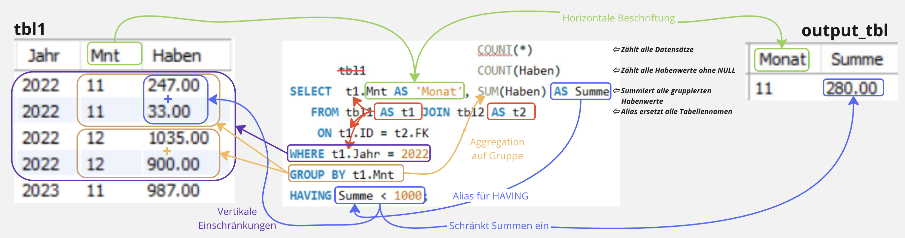

√


# m164 - Datenbanken erstellen und Daten einfügen

[TOC]

---

# Tag 5

>  <br> Recap / Q&A Tag 4  <br>
> [Lösung 4.Tag](4T_Loes.md)

. 

>  <br> **Intro Löschen und Datenintegrität** <br> (Fürs Selbststudium: Diese [Präsentation](./Datenintegritaet_in_DB.pdf) fasst das Thema ausführlich zusammen und erklärt Ihnen zusätzlich die Änderungs- und Löschweitergabe in einer Datenbank.)

## Löschen in professionellen Datenbanken


Die Standardoperationen, die über SQL an Datenbankbeständen von den Anwendern ausgeführt werden, sind Daten erfassen, verändern, abfragen und löschen. **In fast allen professionellen Applikationen ist die Löschfunktion – also der SQL-Befehl `delete` – jedoch Tabu. Damit wäre ein Informationsverlust verbunden, der aus verschiedenen Gründen unerwünscht ist.** 

Ein typischer Denkfehler von Datenbankneulingen ist es zum Beispiel, einen austretenden Mitarbeiter aus der Personaltabelle zu löschen. Wenn ich diesen Datensatz aber wirklich entferne, gehen mir sämtliche Beziehungen verloren, die damit in Verbindung stehen. Ich kann also nicht mehr nachvollziehen, welche Aktionen dieser Mitarbeiter früher gemacht hat. Innerhalb von Banken werden zum Beispiel die Zugriffe auf Kontodaten genau protokolliert. Wenn der austretende Mitarbeiter also gelöscht würde, wären sämtliche Aktivitäten von ihm **nicht mehr nachvollziehbar**. Das könnte zum Teil sogar **juristische Probleme** geben.

Die Lösung im Falle der Mitarbeiterdaten wäre also, dass ich keine Daten lösche, sondern meinen Informationsbestand um die **Austrittsdaten erweitere** und den Mitarbeiterdatensatz eventuell als inaktiv markiere, was aber aufgrund der Austrittsdaten genau genommen redundant ist.

Auch zeitliche Abläufe werden nicht durch Überschreiben (update) bestehender Einträge abgebildet. Ein Gegenstand, der mehrmals hintereinander an verschiedene Personen verliehen wird, hat nicht nur einen Fremdschlüssel, der auf die jeweils aktuelle Person zeigt, sondern ich benötige **weitere Tabellen, um die zeitliche Dynamik statisch abzubilden**. Schliesslich sollen von der Datenbank Informationen und Auswertungen auch aus der Vergangenheit gemacht werden (z. B. wie viel Prozent der Zeit war der Artikel x ausgeliehen?).

Betrachten wir als nächstes Beispiel ein Kassensystem. Wenn ein Einkauf getätigt und erfasst worden ist, merkt der Kunde, dass er zu wenig Bargeld dabei hat, und möchte auf den Kauf verzichten. Wenn das Datenbanksystem jetzt ein einfaches Löschen der zugehörigen Datensätze erlaubt, wäre das gleiche Verhalten auch missbräuchlich verwendbar. Es können ein paar Datensätze gelöscht werden, und schon wäre überzähliges Bargeld in der Kasse und jeden Abend Party in der Verkaufsabteilung. Andererseits kann ich den Kunden auch nicht zum Kauf verpflichten, nur weil meine Datenbank keine Korrekturmöglichkeit hat. Dieses Problem ist aber über **Stornierungen** möglich. Dabei kann ich je nach Informationsstruktur spezielle Tabellen für die Stornierungsbuchungen haben oder ich speichere sie in den gleichen Tabellen wie die Buchungen ab, aber mit zusätzlichen Informationen für die Zeit, den Stornierungsgrund usw.

Wenn die Datenbank mit referentieller Integrität erstellt wurde, werden die Beziehungen vom DBMS verwaltet und überwacht (FK-Constraints). In diesem Fall kann ich die Daten schon aus technischen Gründen nicht löschen, es sei denn, ich lösche auch die in Beziehung stehenden Datensätze. Stellen Sie sich aber ein System wie Wikipedia vor. Der Benutzer hat Einträge und Veränderungen an diversen Orten vorgenommen. Diese Veränderungen sind dann von anderen Benutzern auch wieder verändert worden. Da in Wikisystemen alle Aktivitäten historisiert werden, kann ich aus dieser Veränderungshistorie nicht einfach Informationen löschen. Aus diesem Grund werden auf Wikipedia Benutzernamen auch dann nicht gelöscht, wenn sie zur Kategorie „bäh“ gehören. Sie werden bestenfalls gesperrt, damit unter diesem Namen keine weiteren Aktivitäten erfolgen können.


# Datenintegrität (4 Integritätsregeln)

Datenintegrität in einer Datenbank bezieht sich auf die Genauigkeit, Konsistenz und Vollständigkeit der in der Datenbank gespeicherten Daten. Sie stellt sicher, dass die Daten korrekt sind und nicht versehentlich oder absichtlich verändert werden.

Es gibt vier Integritätsregeln der Datenintegrität:

1. **Eindeutigkeit und Datenkonsistenz**: Jeder Datensatz in der Datenbank sollte eindeutig identifizierbar und dauerhaft sein, um zu verhindern, dass Daten doppelt eingegeben werden (Redundanzen), bzw. ihren Zustand ungewollt ändern könnten. (= Entitätsintegrität)

2. **Referenzielle Integrität**: Wenn eine Tabelle Beziehungen zu anderen Tabellen hat, sollten die Beziehungen immer konsistent bleiben. Das bedeutet, dass z.B. eine Verknüpfung zwischen einer Bestellung und einem Kunden nur dann bestehen kann, wenn der Kunde auch tatsächlich in der Kundentabelle vorhanden ist.

3. **Datentypen**: Die Daten sollten in der Datenbank in den korrekten Datentypen gespeichert werden, um sicherzustellen, dass sie korrekt behandelt werden können. Beispielsweise sollte eine Telefonnummer in einem Feld vom Typ "string" (Zeichenfolge) und nicht vom Typ "integer" (Ganzzahl) gespeichert werden. (= Bereichswertintegrität)

4. **Datenbeschränkungen**: Datenbeschränkungen stellen sicher, dass die Daten in der Datenbank gültig sind. Zum Beispiel kann eine Datenbank so eingerichtet werden, dass nur positive Zahlen in einem bestimmten Feld eingegeben werden dürfen, oder dass eine E-Mail-Adresse nur in einem bestimmten Format eingegeben werden kann. (= Benutzerdefinierte Integrität)

Insgesamt sind diese vier Integritätsregeln zentral, da sie sicherstellen, dass die Daten in der Datenbank korrekt sind und somit zuverlässige Informationen bereitgestellt werden können.


## Fremdschlüssel-Regeln beim Löschen
Was passiert, wenn wir einen Beziehungs-Constraint (FOREIGN KEY-Constraint) haben und einen Datensatz in der Primärtabelle gelöscht haben? Zu diesem Zweck gibt es **ON DELETE**-Regeln (Option):

| DELETE | Regel | Bedeutung |
|---|---|---|
| ON DELETE | **NO ACTION** <br> <br> <br> (**RESTRICT**) | Ein DELETE in der Primärtabelle kann nur ausgeführt werden, wenn in keiner Detailtabelle ein Fremdschlüssel mit dem entsprechenden Wert existiert. Die Überprüfung geschieht am Ende der Transkation. <br> *NO ACTION ist das Standardverfahren, wenn nichts angegeben wird.* <br><br> (RESTRICT: Die Überprüfung geschieht auch innerhalb der Transkation direkt nach jedem Befehl.) |
| | **CASCADE** | Ein DELETE in der Primärtabelle führt auch zu einem Löschen der entsprechenden Datensätze in der Fremdschlüsseltabelle. <br> **Achtung mit dieser Regel, evtl. werden unbeabsichtigt Daten gelöscht!** |
| | **SET NULL** <br><br><br>  (**DEFAULT**) | Bei einem DELETE in der Primärtabelle werden die entsprechenden Datensätze in der Fremdschlüsseltabelle auf NULL gesetzt. <br> **Hinweis: Diese Einstellung geht nur bei c:m(c) und c:c Beziehungen, wenn also beim FK NULL erlaubt ist!** <br><br> (DEFAULT: Falls ein Default-Wert definiert ist, wird *dieser* anstatt NULL gesetzt.) |


Neben den ON DELETE-Regeln gibt es auch die **ON UPDATE**-Regeln. Diese kommen zum Zug, wenn ein Primärschlüsselwert ändert. Jedoch lassen wir die Primärschlüsselwerte (*ohne weiteren Informationsgehalt*) vom System verwalten (AUTO INCREMENT). Die ID-Werte ändern sich also nie, deshalb sind die ON UPDATE-Regeln für uns irrelevant.



Nach Forward Engineering werden die FK-Constraints erstellt:



> Hinweis: Sie können die Standard-Regeln in den Settings Modeling>Defaults verändern: <br> ON-UPDATE > NO ACTION, ON-DELETE > RESTRICT


<br>

### Auftrag 

 *Zeit: ca. 40 Min, Form: 2er Team*


1.  Machen Sie eine kurze Notiz über das **Löschen in DBs** in Ihrem Lernportfolio!
2.  Machen Sie eine kurze **Zusammenfassung des Themas Datenintegrität** in Ihrem Lernportfolio!
3.  Machen Sie eine kurze Notiz über die **FK-Constraint-Options** in Ihrem Lernportfolio!
4. Setzen Sie den [Auftrag Referentielle Integrität](./Referentielle_Datenintegritaet.md) um.
5. Setzen Sie den [Auftrag Referentielle Integrität Fortgeschritten](./Referentielle_Datentegritaet_Fortgeschritten.md) um.<br>


<br><br><br>

---


 *Zeit: ca. 2-3 Lekt., Einzelarbeit / 2er Team*

# SELECT ALIAS 

Ein Alias in SQL wird verwendet, um einer **Spalte** (siehe Bild blau) in einer Tabelle oder einer **Tabelle** (siehe Bild rot/grün) einen **temporären Namen** zu geben. 



1. **Aliase zu den Spalten** werden verwendet, um Spaltennamen lzu beschriften. Ein Spalten-Alias existiert nur für die Dauer dieser Abfrage. 
2. **Tabellen-Aliase** müssen im gesamten Statement benutzt werden. Im oberen Beispiel kann also nicht `SELECT person.nachname ...` stehen - `person` wird *überall* mit `p` ersetzt!


<br>

### Auftrag

1. Lösen Sie folgenden Auftrag: [SELECT ALIAS](SELECT_ALIAS.md)

 Ablage im Lernportfolio (Scripte und Resultate)

---

# Aggregatsfunktionen


In MySQL gibt es Aggregatsfunktionen, die verwendet werden, um Daten einer Spalte **zusammenzufassen** oder zu **berechnen**. 

**Diese Funktionen werden normalerweise in Verbindung mit dem GROUP BY-Statement verwendet, um Daten in Gruppen zu gruppieren und dann auf diesen Gruppen berechnen oder zusammenfassen zu können. (Siehe nächstes Kapitel)**

> Für diejenigen, die den ÜK noch nicht hatten:  [Präsentation Aggregatsfunktionen](Aggregatsfunktionen.pdf) liefert Ihnen detaillierte Erklärungen. Siehe auch [w3school](https://www.w3schools.com/sql//sql_aggregate_functions.asp)

Hier sind einige der häufigsten Aggregatsfunktionen in MySQL:

## COUNT
Diese Funktion gibt die Anzahl der Zeilen in einer Tabelle oder Gruppe zurück. Sie kann auch verwendet werden, um die Anzahl von `NULL`-Werten in einer Spalte zu zählen.

Beispiel:

```sql
SELECT COUNT(*) FROM customers;
```
Das gibt die **Anzahl aller Datensätze** in der Tabelle `customers` zurück.

```sql
SELECT COUNT(salary) FROM customers;
```

Das gibt die Anzahl aller Zeilen der Spalte 'salary' **ohne `NULL`** in der Tabelle `customers` zurück.

## SUM
Diese Funktion berechnet die Summe der Werte in einer Spalte oder Gruppe.

Beispiel:

```sql
SELECT SUM(salary) FROM employees;
```
Das gibt die Summe der Werte in der Spalte `salary` der Tabelle `employees` zurück.

## AVG
Diese Funktion berechnet den Durchschnittswert der Werte in einer Spalte oder Gruppe.

Beispiel:

```sql
SELECT AVG(salary) FROM employees;
```
Das gibt den Durchschnittswert der Werte in der Spalte `salary` der Tabelle `employees` zurück.

## MIN
Diese Funktion gibt den kleinsten Wert in einer Spalte oder Gruppe zurück.

Beispiel:

```sql
SELECT MIN(salary) FROM employees;
```
Das gibt den kleinsten Wert in der Spalte `salary` der Tabelle `employees` zurück.

## MAX
Diese Funktion gibt den größten Wert in einer Spalte oder Gruppe zurück.

Beispiel:

```sql
SELECT MAX(salary) FROM employees;
```
Das gibt den größten Wert in der Spalte `salary` der Tabelle `employees` zurück.

Diese Aggregatsfunktionen können auch in Kombination verwendet werden, um komplexe Abfragen auszuführen und zusammengefasste Ergebnisse zu erhalten.

<br>

### Auftrag:

 *Zeit: 35min, Einzelarbeit*


1. Setzen Sie den [Auftrag Aggregatsfunktionen](Aggregatsfunktionen.md) um.

 Ablage im Lernportfolio (Scripte und Resultate)


<br><br><br>

---

# Sag Fritz, warum geht Herbert oft laufen?


 
**Merksatz** für den SELECT Aufbau: **S**ag **F**ritz, **w**arum **g**eht **H**erbert **o**ft **l**aufen?




---

# GROUP BY


In MySQL wird das GROUP BY-Statement verwendet, um Daten in Gruppen zu gruppieren und zusammenzufassen. Es wird normalerweise zusammen mit Aggregatsfunktionen wie `COUNT`, `SUM`, `AVG`, `MIN` und `MAX` verwendet, um Daten in jeder Gruppe zusammenzufassen und die Ergebnisse zu erhalten.

> Für diejenigen, die den ÜK noch nicht hatten:  [SELECT GROUP BY](select_group_by.pdf) liefert Ihnen detaillierte Erklärungen. Siehe auch [w3School](https://www.w3schools.com/sql//sql_groupby.asp)

Das `GROUP BY`-Statement gruppiert Daten, basierend auf dem Inhalt einer oder mehrerer Spalten. Das bedeutet, dass alle Zeilen mit demselben Wert in der Gruppierungsspalte in einer Gruppe zusammengefasst werden. Das GROUP BY-Statement gibt dann eine Ergebnismenge zurück, die die Ergebnisse der Aggregatsfunktionen für jede Gruppe enthält.

Hier ist ein Beispiel für die Verwendung des `GROUP BY`-Statements in MySQL:

Angenommen, wir haben eine Tabelle mit dem Namen "orders", die folgende Spalten enthält: 

- "order_id"
- "customer_id"
- "order_date"
- "order_total"
 
Wir möchten den Gesamtwert der Bestellungen für jeden Kunden berechnen und die Ergebnisse nach Kunden gruppieren.

Wir können dies mit dem `GROUP BY`-Statement wie folgt tun:

```sql
SELECT customer_id, SUM(order_total)
FROM orders
GROUP BY customer_id;
```
In diesem Beispiel werden die Daten in der Tabelle `orders` nach der Spalte `customer_id` gruppiert. Die Funktion `SUM` wird verwendet, um den Gesamtwert der Bestellungen für jede Gruppe zu berechnen. Das Ergebnis zeigt die Kunden-ID und den Gesamtwert der Bestellungen für jeden Kunden.

Das Ergebnis der Abfrage wird folgendermaßen aussehen:

|customer_id|SUM(order_total)|
|-----------|----------------|
|1|350.50|
|2|210.00|
|3|450.25|

Wie man sehen kann, gibt es eine separate Zeile für jede Kunden-ID, die den Gesamtwert der Bestellungen für diesen Kunden enthält. Durch die Verwendung des GROUP BY-Statements können wir Daten in Gruppen zusammenfassen und aggregieren, um nützliche Informationen aus unseren Tabellen zu extrahieren.


<br>

### Auftrag

 *Zeit: 35min, Einzelarbeit*


1. Setzen Sie den [Auftrag Select group by](select_group_by.md) um.<br>
2. Setzen Sie den [Auftrag Select group by order](select_groupby_order.md) um.

 Ablage im Lernportfolio (Scripte und Resultate)

---

# HAVING Condition


In MySQL wird das `HAVING`-Statement verwendet, um Ergebnisse von Gruppierungsoperationen zu filtern, die durch das `GROUP BY`-Statement durchgeführt werden. Die `HAVING`-Klausel wird verwendet, um Bedingungen auf die aggregierten Ergebnisse anzuwenden, die von den Aggregatfunktionen zurückgegeben werden, die im `SELECT`-Statement verwendet werden.

> Für diejenigen, die den ÜK noch nicht hatten: [Die Präsentation SELECT HAVING](select_having.pdf) liefert Ihnen detaillierte Erklärungen. Siehe auch [w3school](https://www.w3schools.com/sql//sql_having.asp)

 

Im Gegensatz zum `WHERE`-Statement, das auf Zeilen vor der Gruppierung angewendet wird, wird die `HAVING`-Klausel auf die aggregierten Ergebnisse nach der Gruppierung angewendet.

Hier ist ein Beispiel für die Verwendung von `HAVING` in MySQL:

Angenommen, wir haben eine Tabelle mit dem Namen "orders", die folgende Spalten enthält: 

- "order_id"
- "customer_id"
- "order_date"
- "order_total"
 
Wir möchten den Gesamtwert der Bestellungen für jeden Kunden berechnen und nur die Kunden auswählen, deren Bestellsumme größer als 500 ist.

Wir können dies mit dem `GROUP BY`- und `HAVING`-Statement wie folgt tun:

```sql
SELECT customer_id, SUM(order_total)
FROM orders
GROUP BY customer_id
HAVING SUM(order_total) > 500;
```

In diesem Beispiel werden die Daten in der Tabelle `orders` nach der Spalte `customer_id` gruppiert. Die Funktion `SUM` wird verwendet, um den Gesamtwert der Bestellungen für jede Gruppe zu berechnen. Dann wird das HAVING-Statement verwendet, um nur die Kunden auszuwählen, deren Gesamtbestellsumme größer als 500 ist.

Das Ergebnis der Abfrage wird folgendermaßen aussehen:

|customer_id|SUM(order_total)|
|-----------|----------------|
|1|650.50|
|3|900.25|

Wie man sehen kann, wurden nur die Kunden zurückgegeben, deren Bestellsumme größer als 500 ist. Durch die Verwendung von `HAVING` in Kombination mit GROUP BY können wir die Ergebnisse unserer Abfragen weiter filtern und verfeinern.

<br>

### Auftrag:

 *Zeit: 35min, Einzelarbeit*


1. Setzen Sie den [Auftrag Select having](select_having.md) um.
2. Setzen Sie den [Auftrag Select having für Fortgeschrittene](select_having_2.md) um.

 Ablage im Lernportfolio (Scripte und Resultate)


---


# Checkpoint

- Nennen Sie die vier Aspekte der **Datenintegrität** in einer Datenbank.
- Was ist der Unterschied zwischen **Datenintegrität** und **Datenkonsistenz**?
- Was ist die **Gefahr** bei der FK-Constraint-Option `ON DELETE Cascade`?
- Was ist der **Unterschied** zwischen `COUNT(*)` und `COUNT(attr)`?
- Formuliere einen SELECT-Befehl mit der `WHERE BETWEEN` Klausel. ([Tipp](https://www.w3schools.com/sql//sql_between.asp))
- Worauf müssen Sie bei der **HAVING** Klausel achten?


<br> 

---


## Referenzen

- [Select](https://dev.mysql.com/doc/refman/8.0/en/select.html)
- [Zusammenzählende Funktionen](https://dev.mysql.com/doc/refman/8.0/en/aggregate-functions.html)
- [Group by](https://dev.mysql.com/doc/refman/8.0/en/group-by-modifiers.html)


