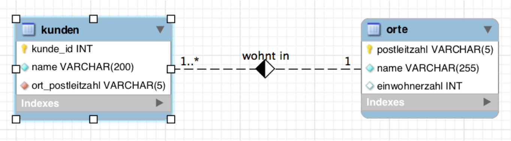

# Auftrag ALIAS



Führen Sie folgendes Skript aus: [kunden-einfach.sql](../Daten/kunden-einfach.sql)

### Aufgaben

1.  Ergänzen Sie folgende Statements und überprüfen Sie die Funktion:

	```SQL
	SELECT \__________________\_ FROM kunden AS kundenliste 
	    WHERE kundenliste.ort_postleitzahl \> 80000
	
	    \-- ausgegeben werden sollen kunde_id, Name des Kunden und Postleitzahl des Kunden
	```
	
	```SQL
	SELECT o.name, k.name FROM \__________________\_ 
	     WHERE o.name LIKE '%n' AND o.postleitzahl = k.ort_postleitzahl
	```

2.  Korrigieren Sie die folgenden Statements, dass sie funktionieren.

	```SQL
	\-- Aliasse 'prfz' und 'hrgs' bitte nicht verändern!
	
    SELECT kunde_id, kunden.name, orte.name FROM kunden AS hrgs 
	    INNER JOIN ort AS prfz 
	    ON o.postleitzahl = k.ort_postleitzahl 
	    ORDER BY k.kunde_id
	```
	
	```SQL
	    \-- Fügen Sie alle möglichen und notwendigen Aliasse ein!
	
	    SELECT k.name, o.postleitzahl, o.name FROM kunden, orte WHERE k.name LIKE '%a%' AND o.name LIKE '%u%' AND k.ort_postleitzahl = o.postleitzahl
	```
