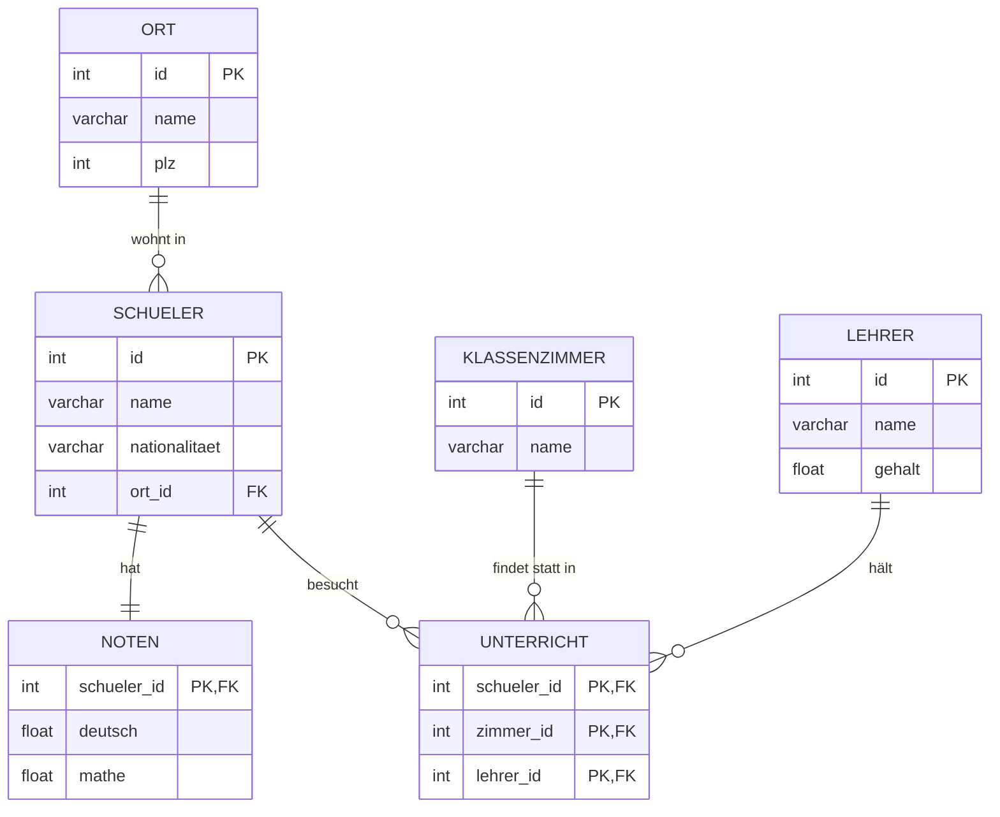

# Lösungen: SELECT HAVING I

**(Basierend auf dem typischen Schema der `schuleDatenbank`)**



**1.a. Geben Sie eine Liste der Durchschnittsnoten aller Schüler aus; es werden aber nur die Schüler ausgegeben, deren Durchschnitt besser als 4 ist.**
```sql
SELECT s.name, AVG((n.deutsch + n.mathe) / 2) AS Durchschnittsnote
FROM schueler s
JOIN noten n ON s.id = n.schueler_id
GROUP BY s.name
HAVING AVG((n.deutsch + n.mathe) / 2) < 4; 
-- oder > 4, je nachdem ob 'besser' hier 'höhere Zahl' (wie in D) oder 'kleinere Zahl' (wie in CH: 1=beste, 6=schlechteste, oder D: 1=beste) meint
-- Angenommen deutsches System (besser als 4 bedeutet NOTENWERT < 4):
-- HAVING AVG(note) < 4;
-- Schweizer System (besser als 4 bedeutet NOTENWERT > 4):
-- HAVING AVG(note) > 4;
```
*(Da diese Aufgabe von Noten spricht: Ich nutze hier > 4 in Annahme an das schweizer Notensystem, da der M164 Kurs oft aus der Schweiz stammt. Wenn deutsches System: < 4).*
```sql
SELECT s.name, ((n.deutsch + n.mathe) / 2) AS Durchschnittsnote
FROM schueler s
JOIN noten n ON s.id = n.schueler_id
HAVING Durchschnittsnote > 4;
```

**1.b. Runden Sie in der vorigen Aufgabe die Durchschnittsnote auf eine Dezimale und sortieren Sie die Ausgabe nach der Durchschnittsnote aufsteigend.**
```sql
SELECT s.name, ROUND(((n.deutsch + n.mathe) / 2), 1) AS Durchschnittsnote
FROM schueler s
JOIN noten n ON s.id = n.schueler_id
HAVING Durchschnittsnote > 4
ORDER BY Durchschnittsnote ASC;
```

**2. Geben Sie eine Liste aller Lehrer und ihres Nettogehalts aus (nur > 3000 Euro).**
```sql
SELECT name, (gehalt * 0.7) AS Nettogehalt
FROM lehrer
HAVING Nettogehalt > 3000;
```

**3. Eine Liste der Klassenzimmer und die in diesen Klassenzimmern unterrichteten Schüler (nur < 10 Schüler).**
```sql
SELECT k.name AS Klassenzimmer, COUNT(s.id) AS Anzahl
FROM klassenzimmer k
JOIN unterricht u ON k.id = u.zimmer_id
JOIN schueler s ON u.schueler_id = s.id
GROUP BY k.id, k.name
HAVING COUNT(s.id) < 10;
```

**4.a. Wie viele Schüler mit russischer Herkunft wohnen in den einzelnen Orten?**
```sql
SELECT COUNT(s.id) AS Anzahl, o.name AS `Ort-Name`
FROM schueler s
JOIN ort o ON s.ort_id = o.id
WHERE s.nationalitaet = 'RU'
GROUP BY o.id, o.name
ORDER BY o.name ASC;
```

**4.b. Erweitern Sie die Aufgabe 4.a so, dass nur die Orte ausgegeben werden, in denen 10 oder mehr russischstämmige Schüler wohnen.**
```sql
SELECT COUNT(s.id) AS Anzahl, o.name AS `Ort-Name`
FROM schueler s
JOIN ort o ON s.ort_id = o.id
WHERE s.nationalitaet = 'RU'
GROUP BY o.id, o.name
HAVING COUNT(s.id) >= 10
ORDER BY o.name ASC;
```
