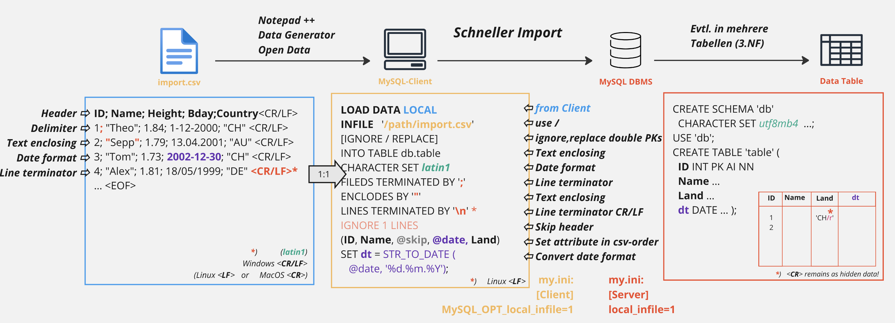
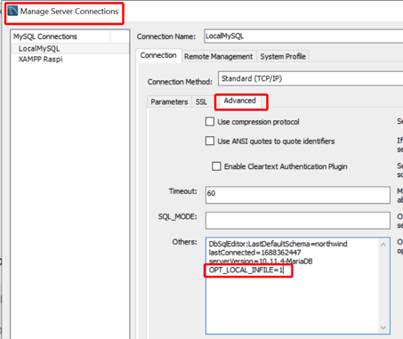
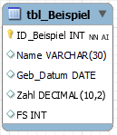
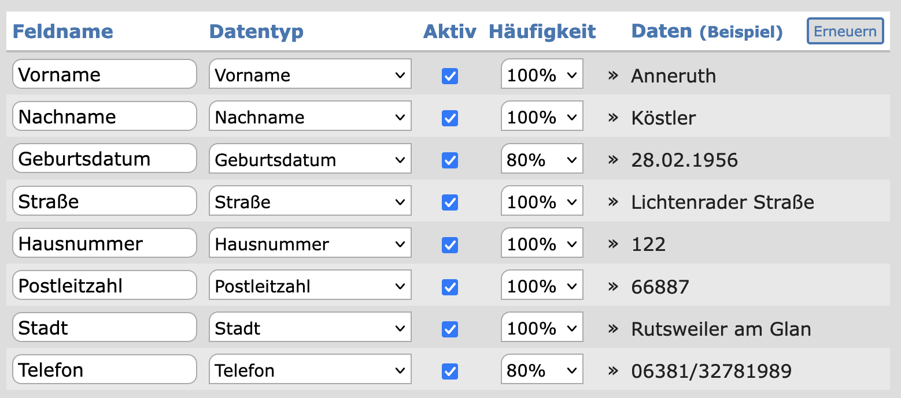
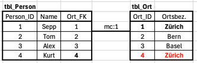
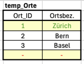
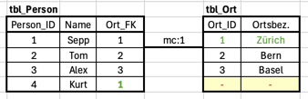

√


# m164 - Datenbanken erstellen und Daten einfügen

[TOC]

---

# Tag 6

>  <br>Recap / Q&A Tag 5  <br>
> [Lösung 5.Tag](5T_Loes.md)

# SUBQUERY (SUBSELECT / Unterabfrage)


Ein `Subselect` in einer MySQL-Datenbank ist eine Abfrage **innerhalb einer anderen Abfrage**. Es wird verwendet, um Daten aus einer Tabelle abzurufen, die die Bedingungen erfüllen, die auf der Grundlage von Daten in einer anderen Tabelle ermittelt werden.
Unterabfragen können an verschiedenen Stellen in einer SQL-Abfrage verwendet werden, z. B. in den Klauseln `WHERE`, `FROM`, `HAVING` und `SELECT`. Darüber hinaus kann eine Unterabfrage auch als Teil einer Anweisung `UPDATE`, `DELETE` oder `INSERT` verwendet werden. 

> Tutorial: [Subquery Tutorial](https://www.mysqltutorial.org/mysql-subquery)

Wenn Sie Unterabfragen verwenden:

   - Sie müssen die Unterabfrage immer in Klammern einschliessen.
   - Achten Sie auf den Operator, mit dem Sie das Ergebnis der Unterabfrage vergleichen: (*skalar* oder *nicht-skalar*)


## Skalare Unterabfrage

Eine *skalare* Unterabfrage gibt nur **eine Spalte** mit nur **einer Zeile** zurück. Es gibt viele Operatoren, mit denen wir eine Spalte mit einer Subquery vergleichen können. Einige von ihnen können jedoch nur mit skalaren Unterabfragen verwendet werden: `=`, `>`, `>=`, `<` und `<=`. Wenn Sie einen dieser Operatoren verwenden, muss Ihre Unterabfrage *skalar* sein.

Sehen wir uns ein Beispiel mit einer skalaren Unterabfrage an. Angenommen, Sie haben einen Kunden, der von Paris nach Bariloche reisen möchte. Bevor er das Ticket kauft, möchte er sehen, ob es Orte gibt, an denen das Ticket günstiger ist. Die folgende Abfrage findet diese Städte:

```SQL
SELECT city_destination, ticket_price, travel_time, transportation FROM one_way_ticket
  WHERE ticket_price < (
      SELECT MIN(ticket_price) FROM one_way_ticket
      WHERE city_destination = 'Bariloche' AND city_origin = 'Paris'
      )
  AND city_origin = 'Paris';
```

Auch hier wird zuerst die Subquery ausgeführt; ihr Ergebnis (der Preis für ein Ticket Paris-Bariloche, also 970 \$) wird mit der Spalte `ticket_price` in der äusseren Abfrage verglichen. So erhält man alle Datensätze in `one_way_ticket` mit einem `ticket_price` Wert kleiner als $970. Das Ergebnis der Abfrage ist unten dargestellt:

| City_Destination	| Ticket_Price	| Travel_Time | Transportation |
|---|---|---|---|
| Bariloche	| 830.00	| 11hr 30min | air |


## Nicht-skalare Unterabfrage

Hier ist ein Beispiel für eine *nicht-skalare* `SELECT`-Abfrage mit einem [DB für Subselect](../Daten/subselect.sql):

```sql
use subselect;
SELECT name, age, country
FROM users
WHERE country IN 
(  -- hier beginnt Subquery: 
   SELECT name FROM country WHERE region = 'Europa'
)
```

In diesem Beispiel werden die Namen und Altersangaben von Benutzern aus der Tabelle `users` abgerufen, die in europäischen Ländern leben. Das Subselect wird verwendet, um die Länder in Europa zu ermitteln, indem es eine Abfrage auf der Tabelle `countries` ausführt und nach dem Eintrag "`Europe`" in der Spalte `region` sucht.

Das Ergebnis des *nicht-skalaren* Subquerys ist eine **Liste von Ländern**, die dann als Bedingung für die `WHERE`-Klausel in der Hauptabfrage verwendet werden, um die Datensätze zu filtern, die die Bedingung erfüllen: **IN** oder auch **NOT IN** für alle anderen.

## Weitere Beispiele

Eine Subquery kann auch als Teil einer `JOIN`-Abfrage verwendet werden, um Daten aus mehreren Tabellen abzurufen.

Hier ist ein Beispiel mit der Datenbank [northwind](../Daten/northwind.sql):

```sql
use northwind;
SELECT customers.ContactName, orders.orderdate FROM customers
  INNER JOIN orders ON customers.customerid = orders.customerid
  WHERE orders.orderdate IN           -- Ist Rechnungsdatum = letztes Rechnungsdatum?
  (
    SELECT MAX(orderdate) FROM orders -- Letztes Bestelldatum der einzelnen Kunden
    GROUP BY customerid
   );
```

In diesem Beispiel werden die Namen der Kunden und ihre letzten Bestelldaten aus der Tabelle `customers` und `orders` abgerufen. Das Subselect wird verwendet, um die neuesten Bestelldaten für jeden Kunden zu ermitteln, indem es eine Abfrage auf der Tabelle `orders` ausführt, die nach dem maximalen Datum gruppiert ist. Das Ergebnis des `Subselects` ist eine Liste der neuesten Bestelldaten für jeden Kunden.

Die Hauptabfrage verwendet dann die `JOIN`-Klausel, um die Datensätze aus den Tabellen `customers` und `orders` zu verknüpfen, indem sie den Kunden-IDs in beiden Tabellen entsprechen. Die `WHERE`-Klausel filtert die Datensätze, die die Bedingung erfüllen, indem sie die neuesten Bestelldaten für jeden Kunden verwendet, die aus dem `Subselect` stammen.

Auf diese Weise können Sie mit einem `Subselect` als Teil einer `JOIN`-Abfrage komplexe Datenabfragen durchführen, die Daten aus mehreren Tabellen kombinieren und filtern.

> ACHTUNG: Wie in diesem Beispiel sichtbar, werden nicht nur die letzten Daten der einzelnen Kunden ausgegeben, sondern auch die (per Zufall) gleichen Daten von anderen Kunden! **Durch diesen Subselect werden also auch Datensätze erzeugt, die nicht tatsächlich miteinander zu tun haben!**

<br>
Hier noch weitere Beispiele:

```sql
SELECT MAX(average.average_price) 
FROM (
		SELECT product_category, AVG(price) AS average_price FROM product
		GROUP BY product_category
) average;   
              
SELECT Name FROM Mitarbeiter m
WHERE EXISTS (
               SELECT 1 FROM Projekte p 
			   WHERE m.MitarbeiterID = p.MitarbeiterID AND p.Status = 'Aktiv'
			  );
			  
SELECT city_destination, ticket_price, temp_table.quantity FROM one_way_ticket
   JOIN (
			SELECT closest_city AS city, count(*) AS quantity
			FROM best_10_places GROUP BY 1
		) AS temp_table ON one_way_ticket.temp_table.city;
```
Operatoren, wie `IN`, `EXISTS` oder `NOT EXISTS`, `> ALL`, `= ANY`, können auch mit *skalaren* Unterabfragen verwendet werden.

<br>

### Auftrag

 *Zeit: 35min, Einzelarbeit*


1. Setzen Sie den [Subselect Auftrag](./select_Subquery.md) um.

 Ablage im Lernportfolio (Scripte und Resultate)

---

<br><br><br>

---


# Bulkimport: Mysql Data Loader `LOAD DATA INFILE`


 <br> Mysql bietet die Möglichkeit, CSV-Files effizient und *schnell* in eine Tabelle einzulesen.



## CSV-Datei vom Server laden

Das Kommando dazu heisst `LOAD DATA INFILE "C:/path/import.csv" ...`. 

Mit diesem Kommando, versucht der MariaDB Server, die Eingabedatei aus **seinem eigenen Dateisystem zu lesen**. Ohne Pfadangabe sucht der Server die Datei im Data-Verzeichnis der aktuellen Datenbasis: `C:\...\mySQL\data\db\`. 

>  **Achtung**: Pfadeingaben in MySQL müssen mit **/** - wie bei Linux/Unix/macOS - erfolgen! (Nicht mit **\\** wie bei Windows!) 

>  **Achtung**: Auch Umlaute wie 'ü' sind nicht erlaubt &rarr; 'Schueler.csv'! (Errorcode 29)
> <br> Ein Error 13 "Permission denied" könnte mit fehlenden Berechtigungen auf One-Drive-Ordner zusammenhängen. Wahlen Sie z.B. den Import-Ordner `C:/M164/import.csv`.
> 

## CSV-Datei vom Client laden (Local!)

`LOAD DATA LOCAL INFILE "C:/path/import.csv" ...`

Beachten Sie den Zusatz `LOCAL`! Wenn Sie diese Anweisung ausführen, versucht der **Klient, die Eingabedatei aus seinem Dateisystem** zu lesen, und sendet den Inhalt der Eingabedatei an den MariaDB Server. Auf diese Weise können Sie Dateien aus dem **lokalen Dateisystem des Klienten** in die Datenbank laden.

### Settings

Dieser Vorgang ist üblicherweise aus Sicherheitsgründen im Server und im Klient deaktiviert!

1. Der **Server** sollte folgende Einstellung haben: `local_infile=1` <br>
   Falls nicht, im MySQL-Klinet **setzen** und **anzeigen**:

	```SQL
	SET GLOBAL local_infile=1; -- = ON
	SHOW GLOBAL VARIABLES LIKE 'local_infile';  -- >> Anzeigen
	```

2. Auch sollte kein spezieller Import-Pfad gesetzt sein! 
	
	```SQL
	SHOW VARIABLES LIKE 'secure_file_priv'; -- >> Sollte keinen Pfad enthalten!
	```
	
	Sonst in `my.ini` Abschnitt `[mysqld]` die Zeile mit der Einstellung suchen und anpassen: Einstellung ohne Pfad setzen `secure_file_priv = ""`!
	
	```SQL
	[mysqld]
	...
	secure_file_priv = ""
	```
	
   
3. Der **MySQL.exe-Klient** sollte folgende Einstellung im `my.ini` haben:

	```SQL
	[mysql]
	...
	safe-updates
	MYSQL_OPT_LOCAL_INFILE=1
	```


4. Bei **Workbench** muss die "Connection" angepasst werden: <br>
`OPT_LOCAL_INFILE=1` unter `Database > Manage Connections... > "DB" >  Advanced > Others: ` einfügen

   

   Wenn Sie einen anderen Klient oder eine andere Klient-Bibliothek benutzen, lesen Sie die Dokumentation für Ihren spezifischen Klient oder Ihre Klient-Bibliothek, um festzustellen, wie sie die Anweisung `OPT_LOCAL_INFILE=1` handhabt. 
   
   
5. **Neustart** MySQL-Server (&rarr; Dienstmanager, XAMPP > STOP>START)

---

 *Zeit: ca. 30 Min*


In der [offiziellen Mysql-Dokumentation](https://dev.mysql.com/doc/refman/8.0/en/load-data.html) wird das Statement in allen Details beschrieben!

### Auftrag mit Tutorial

1. Im [Tutorial](https://www.mysqltutorial.org/import-csv-file-mysql-table/) wird erklärt, wie es funktioniert. (&rarr; [discounts.csv](./Daten/discounts.csv), [discounts_2.csv](./Daten/discounts_2.csv))

  **Hinweis Zeichensatz**: *Standardmässig interpretiert der DB-Server den Dateiinhalt anhand des Zeichensatzes, der in der Systemvariablen* `character_set_database` *angegeben ist. Wenn der Dateiinhalt einen anderen Zeichensatz als diesen Standard verwendet, ist es ratsam, diesen Datei-Zeichensatz mit der Klausel* `CHARACTER SET` *anzugeben, um die richtige Konvertierung zu erhalten!*
  
2. Welcher Zeichensatz ist standardmässig bei ihrem DBMS eingestellt?
3. Versuchen Sie, das [CSV File Personen](./Daten/personen.csv) in eine Tabelle einzulesen. Untersuchen Sie die CSV-Datei zuerst: Trennzeichen(Delimiter), ", Spaltennamen, Zeichensatz, Datumformat, ...
4. Kontrollieren Sie, ob 500 Zeilen korrekt importiert wurden.
5. Versuchen Sie auch, weitere 100 DS aus dem [Personen_DE File](./Daten/personen_de.csv) in die Datenbank-Tabelle einzulesen. Warum gibt es Fehler? 
6. Zum Schluss löschen Sie die Datenbasis mit einem SQL-Befehl.


 Ablage im Lernportfolio (Scripte und Resultate)

---


## LOAD DATA LOCAL INFILE Tipps zu Spalten & Attributen

Folgende Tabelle ist gegeben:

```SQL
CREATE SCHEMA IF NOT EXISTS `db_LDLI_Demo` DEFAULT CHARACTER SET utf8mb4 COLLATE utf8mb4_bin ;
USE `db_LDLI_Demo` ;

DROP TABLE IF EXISTS `tbl_Beispiel` ;
CREATE TABLE `tbl_Beispiel` (
  `ID_Beispiel` INT NOT NULL AUTO_INCREMENT,
  `Name` VARCHAR(30) ,
  `Geb_Datum` DATE ,
  `Zahl` DECIMAL(10,2) ,
  `FS` INT  NOT NULL,           -- ACHTUNG: NN !!
  PRIMARY KEY (`ID_Beispiel`))
ENGINE = InnoDB;
```



### 1. Leere Felder und Datumsformat anpassen

[Bsp1.csv](./Bsp1.csv) &rarr; C:\M164\

Testen Sie Auswirkung von leeren Feldern und falschen Datumsformaten. 

```SQL
SET FOREIGN_KEY_CHECKS=0;             -- Constraints werden nicht beachtet
Truncate tbl_Beispiel;  -- Leert Tabelle

LOAD DATA LOCAL INFILE 'C:/M164/bsp1.csv'
    REPLACE                           -- Ersetzt Datensätze mit gleicher ID (PK muss gesetzt sein)
	INTO TABLE tbl_Beispiel
	CHARACTER SET utf8mb4             -- Zeichensatz der CSV-Datei!
	FIELDS TERMINATED BY ','          -- anstatt ";"
	LINES TERMINATED BY '\r\n'        -- Windows CRLF
	IGNORE 1 ROWS                     -- Titelspalte wird übersprungen
	
	(ID_Beispiel,Name, @GD, Zahl, FS) -- Spalten der CSV-Datei und Attribute der tbl_Beispiel stimmen überein
       SET Geb_Datum = STR_TO_DATE(@GD,'%d.%m.%Y'); 
                                     -- Datumanpassung via Variable @GD
                                     
SELECT * FROM tbl_Beispiel;
```

Hier wird das Datumsformat für die DB-Engine angepasst, indem das Datum zuerst in eine Variable `@GD` gelegt und dann per Funktion `STR_TO_DATE()`  umgewandert in das Attribut `Geb_Datum` gespeichert wird. 

 

1. Studieren Sie das CSV-File. Was geschieht jeweils bei **fehlenden Werten**? (ID, Datum, ..., FS (NN) )
2. Studieren Sie die **Warnings** im Output-Fenster.
3. Testen Sie den Import **mit und ohne Datums-Anpassung** (&rarr; `(ID_Beispiel,Name, Geb_Datum, Zahl, FS);`). Resultate?


### 2. Spaltenreihenfolge ändern

[Bsp2.csv](./Bsp2.csv) &rarr; C:\M164\

Die Reihenfolge der Spalten stimmt nicht mit der Reihenfolge der Attribute überein. 

```SQL
Truncate tbl_Beispiel;  -- Leert Tabelle

LOAD DATA LOCAL INFILE 'C:/M164/bsp2.csv'
    REPLACE                           -- Ersetzt Datensätze mit gleicher ID (PK muss gesetzt sein)
	INTO TABLE tbl_Beispiel
	CHARACTER SET utf8mb4             -- Zeichensatz der CSV-Datei!
	FIELDS TERMINATED BY ','          -- anstatt ";"
	LINES TERMINATED BY '\r\n'        -- Windows CRLF
	IGNORE 1 ROWS                     -- Titelspalte wird übersprungen
	
	(ID_Beispiel, @GD, Name, Zahl, FS) -- Spalten der CSV-Datei und Attribute der tbl_Beispiel ggf. vertauschen
       SET Geb_Datum = STR_TO_DATE(@GD,'%d.%m.%Y'); 
       
SELECT * FROM tbl_Beispiel;
```

 

1. Testen Sie den Import mit und ohne Anpassung. Resultate?
2. Beachten Sie die Werte der Fremdschlüssel. '0' als Wert darf es eigentlich nie geben! &rarr; NULL


### 3. Spalten auslassen

[Bsp3.csv](./Bsp3.csv) &rarr; C:\M164\

Es hat zuviele Spalten in der CSV-Datei. Diese können übersprungen werden.

```SQL
...
	(ID_Beispiel,Name, @SkipVN, @GD, Zahl, FS, @SkipPW ) -- Spalten der CSV-Datei mit Dummy-Variablen überspringen
       SET Geb_Datum = STR_TO_DATE(@GD,'%d.%m.%Y');                              
...
```

 

1. Testen Sie den Import mit und ohne Anpassung. Resultate?

### 4. Attribut hinzufügen

[Bsp4.csv](./Bsp4.csv) &rarr; C:\M164\

Es fehlen Spalten in der CSV-Datei für die Attribute der tbl_Beispiel. 

```SQL
...            
	(Name, Geb_Datum, Zahl)    -- ID und FS fehlen 
      SET FS = 1;             -- FS wird bei jedem DS auf 1 gesetzt
...
```

 

1. Was geschieht mit dem **fehlenden ID** Eintrag? (Und ohne AI?)
2. Was geschieht mit dem **fehlenden FS** Eintrag? 
3. Kann hier der **FS auf NULL** gesetzt werden? Warum (nicht)?

### 5. Werte ändern

[Bsp5.csv](./Bsp5.csv) &rarr; C:\M164\

In der Spalte Ort für das Attribut FS_Ort hat es Text anstatt INT. Wenn eine Zuordnung möglich ist, lässt sich das mit einer CASE-Klausel programmieren. Ebenso lassen sich weitere Bedingungen einbauen. 

```SQL
...
    (ID_Beispiel, @GD, Name, Zahl, @Ort) -- Spalten der CSV-Datei über Funktion in Attribut abfüllen
       SET Geb_Datum = STR_TO_DATE(@GD,'%d.%m.%Y'),
       FS = CASE
         WHEN  @Ort = 'Zuerich' THEN 1
         WHEN  @Ort = 'Basel' THEN 2
         WHEN  @Ort = 'St.Gallen' THEN 3
         ELSE NULL
       END; 
...
```

 

*Anmerkung: In der Praxis ist dieses Beispiel nicht praktikabel. Dient nur der Veranschaulichung einer solchen Funktion! Ebenso darf in unserem Beispiel NULL nicht als FS Wert vorkommen (NN). In dem Fall müsste man entweder NULL zulassen oder ein Dummy-Ort zuweisen.*

```
...
   (ID_Beispiel, @GD, Name, Zahl, @FS) 
   SET Geb_Datum = STR_TO_DATE(@GD,'%d.%m.%Y'),
   FS = CASE <br>
      WHEN @FS = 0 THEN NULL     -- oder Dummy-Ort
      ELSE @FS
   END;
...      
```      


---

## Daten aus einer anderen Tabelle einfügen

Es ist möglich, den `INSERT`-Befehl mit einer `SELECT`-Abfrage zu kombinieren, um Daten aus einer anderen Tabelle einzufügen. Hier ist ein Beispiel dafür:

```sql
INSERT INTO customers (name, email, address)
  SELECT name, email, address FROM new_customers;
```

Dieser Befehl fügt neue Zeilen in die Tabelle `customers` ein und füllt die ausgewählten Spalten `name`, `email` und `address` mit den Werten aus der Tabelle `new_customers`.


>  **Hinweis**: Dieser Befehl kann benutzt werden, um aus einer eingelesenen, temporären Tabelle die Daten in eine normaliserte Datenstruktur zu übertragen ...

---

 *Zeit: 30Min, Partnerarbeit 


>  **HINWEIS**: Diese Arbeit ist Vorbereitung auf **LB2**! Arbeiten Sie darum alle Punkte sauber durch! Etwaige Probleme mit Berechtigungen usw. sollten Sie lösen, damit Sie an der LB2 nicht hängen bleiben! 

## Datenbasis DB_Adressen

1. Lassen Sie sich durch ihre(n) KlassenkollegIn **10 Datensätze** (adressen.csv) durch den [Generator](https://migano.de/testdaten.php) mit folgenden Attributen und Häufigkeiten erstellen: 

2. Erstellen Sie eine **Datenbasis** mit dem Namen `db_adressen` und erstellen Sie eine erste (temporäre) **Tabelle** `tbl_Adr` gemäss den obigen Attributen (ID mit *Auto_Increment*). Bei 100%-iger Häufigkeit setzen Sie den Constraint auf `NN`. <br> [Hier Zwischenstand überprüfen: ERD Lösung](./media/DB_Adressen_ERD_Loes_1.png) <br>
3. **Bulkimport**: Importieren Sie die Daten mit `LOAD DATA LOCAL INFILE` und überprüfen Sie nach dem Import die Sonderzeichen wie Umlaute, ß, usw.! <br>
4. **Normalisieren** Sie die Daten in die **3.NF**: `tbl_Person`, `tbl_Str` und `tbl_Ort`. Erstellen Sie die drei Tabellen in der Datenbasis `db_adressen`. <br> Hinweis: Anders als im Modul 162 wollen wir von nun an die Normalisierung maschinell durch SQL-Befehle umsetzten, nicht manuell in EXCEL!!!
5. **Übertragen** Sie die korrekten Attribute nun aus der Tabelle `tbl_Adr` in die normalisierten Tabellen mit `INSERT INTO tbl (..) SELECT attr FROM tbl;`. <br> **Überlegen** Sie sich vorher, wie Sie die Relationen erstellen (Tipp: ID(PK)=FK). *Bemerkung: Wir nehmen an, dass es keine redundanten Orte gibt bei diesen 10 Datensätzen. Auf Redundanz müsste nat. kontrolliert und bereinigt werden: Siehe weiter unten \*!* <br> [Tipp: FK-Constraint Warnung immer vorher ausschalten. Danach Einschalten nicht vergessen!](./media/Tipp_Constraint.png)
6. **Überprüfen** Sie die eingefügten Daten der drei normalisierten Tabellen mit `SELECT attr ... JOIN ... JOIN ...` mit der ursprünglichen CSV-Tabelle! (Tipp: Erzeugen Sie dieselbe Ausgabe entsprechend der Tabelle `tbl_Adr` (3.) !) <br>
7. **Direkter Weg ohne temp. Tabelle `tbl_Adr`**: Löschen Sie alle Daten aus den drei normalisierten Tabellen und laden Sie die korrekten Daten mit `LOAD DATA LOCAL INFILE` direkt aus der CSV-Datei in die drei Tabellen. [Ansatz hier](./media/DB_Adressen_ERD_Loes_2.png)<br> [Tipp LDIF Skip Attributes](./media/LDIF_Skip.png) <br> [Tipp LDIF Add Attribute](./media/LDIF_Add.png) <br> [Tipp LDIF Set Date](./media/LDIF_Date.png) <br> **Überprüfen** Sie ebenfalls die eingefügten Daten der drei normalisierten Tabellen mit `SELECT attr ... JOIN ... JOIN ...` mit der ursprünglichen CSV-Tabelle! 

<br>

 Ablage im Lernportfolio (Scripte und Resultate)

__

*) 
### Finde redundante Datensätze:

```SQL
SELECT Ortsbezeichnung, COUNT(*) as Anzahl FROM tbl_Ort
  GROUP BY Ortsbezeichnung
  HAVING COUNT(*) > 1;
```

Um redundante Ortsbezeichnungen zu **bereinigen**, könnten Sie zuerst eine *eindeutige* ID für jede Ortsbezeichnung erstellen und dann mit dieser ID in der `tbl_Str` Tabelle den `Ort_FK` *aktualisieren*:


 

```SQL
-- Erstelle eine temporäre Tabelle 'temp_Orte' mit eindeutigen IDs für jede Ortsbezeichnung
CREATE TEMPORARY TABLE temp_Orte AS
  SELECT MIN(Ort_ID) as Ort_ID, Ortsbezeichnung
  FROM tbl_Ort
  GROUP BY Ortsbezeichnung;
```

 

```SQL
-- Die beiden Tabellen gegenüberstellen mit Join, um die richtigen  Daten zu wählen (= erster gefundener Ortschaftsdatensatz). 
-- Dieser Befehl ist nur zur Erklärung des nächsten Befehls.

SELECT * FROM tbl_Person pers
 JOIN tbl_Ort ort ON pers.OrtFK = ort.Ort_ID
 JOIN temp_Orte temp_ort ON temp_ort.Ortsbezeichnung = ort.Ortsbezeichnung;
 
-- Aktualisiere die Tabelle 'tbl_Str', um die neuen Ort_IDs (=> Ort_FK) zu 

SET  sql_safe_updates = 0;  -- Ermöglicht UPDATE mit WHERE Klausel ohne dabei eine ID zu adressieren!

UPDATE tbl_Person pers
 JOIN tbl_Ort ort ON pers.OrtFK = ort.Ort_ID
 JOIN temp_Orte temp_ort ON temp_ort.Ortsbezeichnung = ort.Ortsbezeichnung
 SET pers.OrtFK = temp_ort.Ort_ID
    WHERE pers.PersonID > 0 AND pers.OrtFK != temp_ort.Ort_ID;

SET  sql_safe_updates =  1; -- Besser mit einer TRANSAKTION lösen - Erst Commit wenn Resultat überprüft wurde: Siehe M141

SELECT * FROM tbl_Person pers
 JOIN tbl_Ort ort ON pers.OrtFK = ort.Ort_ID;
```

```SQL
-- Entferne redundante Einträge aus der Tabelle 'tbl_Orte'
DELETE tbl_Ort FROM tbl_Ort 
  LEFT JOIN temp_Orte 
  ON tbl_Ort.Ort_ID = temp_Orte.Ort_ID
WHERE temp_Orte.Ort_ID IS NULL;

```


   
<br> 

---


# Checkpoint

- Formulieren Sie einen Satz, der den **Einsatz** von Subqueries erklärt und begründet.
- Was ist der Unterschied zwischen **skalaren** und **nicht-skalaren** Subqueries?
- Gibt es auch Gefahren bei der Verwendung von Subselect?
- Was bedeutet der Zusatz `IGNORE 1 LINES` in `LOAD DATA INFILE`? 
- Sie haben eine Windows-CSV-Datei. Der Import ist aber mit `LINES TERMINATED BY '/n';` eingestellt. Welche Folgen hat das für die letzte Spalte (Attribut) der importierten Daten? Gibt es ein Problem?
- Welche Einstellungen müssen gemacht werden, damit ein Klient eine CSV-Datei dem Server zum Importieren übermitteln darf?
- Wie importieren Sie Spalten in einer anderen Reihenfolge? 


<br> 

---


## Referenzen

- [Subquery Manual](https://dev.mysql.com/doc/refman/8.0/en/subqueries.html)
- [Subquery weitere Beispiele](https://learnsql.de/blog/anleitung-fuer-anfaenger-zur-sql-subquery/)
- [Load Data Infile](https://dev.mysql.com/doc/refman/8.0/en/load-data.html)


