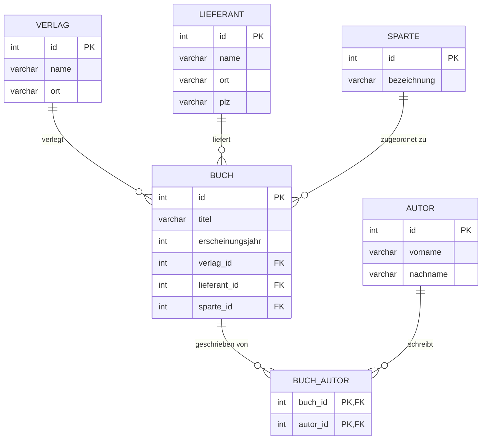

# Lösungen: SUBQUERY

**(Hinweis: Die nachfolgenden Tabellenstrukturen zeigen das `buchladenDatenbank` Schema, auf dem die folgenden SELECT-Queries basieren.)**



## Teil 1 (Skalare Subquery)

**1. Welches ist das teuerste Buch in der Datenbank?**
```sql
SELECT * FROM buch 
WHERE einkaufspreis = (SELECT MAX(einkaufspreis) FROM buch);
```

**2. Welches ist das billigste Buch in der Datenbank?**
```sql
SELECT * FROM buch 
WHERE einkaufspreis = (SELECT MIN(einkaufspreis) FROM buch);
```

**3. Lassen Sie sich alle Bücher ausgeben, deren Einkaufspreis über dem durchschnittlichen Einkaufspreis aller Bücher in der Datenbank liegt.**
```sql
SELECT * FROM buch 
WHERE einkaufspreis > (SELECT AVG(einkaufspreis) FROM buch);
```

**4. Lassen Sie sich alle Bücher ausgeben, deren Einkaufspreis über dem durchschnittlichen Einkaufspreis der Thriller liegt.**
```sql
SELECT * FROM buch 
WHERE einkaufspreis > (
    SELECT AVG(b.einkaufspreis) 
    FROM buch b 
    JOIN sparte s ON b.sparte_id = s.id 
    WHERE s.bezeichnung = 'Thriller'
);
```

**5. Lassen Sie sich alle Thriller ausgeben, deren Einkaufspreis über dem durchschnittlichen Einkaufspreis der Thriller liegt.**
```sql
SELECT b.* 
FROM buch b
JOIN sparte s ON b.sparte_id = s.id
WHERE s.bezeichnung = 'Thriller' 
  AND b.einkaufspreis > (
      SELECT AVG(b2.einkaufspreis) 
      FROM buch b2 
      JOIN sparte s2 ON b2.sparte_id = s2.id 
      WHERE s2.bezeichnung = 'Thriller'
  );
```

**6. Lassen Sie sich alle Bücher ausgeben, bei denen der Gewinn überdurchschnittlich ist; bei der Berechnung des Gewinndurchschnitts berücksichtigen Sie NICHT das Buch mit der id 22.**
*(Annahme: Gewinn = verkaufspreis - einkaufspreis)*
```sql
SELECT * 
FROM buch 
WHERE (verkaufspreis - einkaufspreis) > (
    SELECT AVG(verkaufspreis - einkaufspreis) 
    FROM buch 
    WHERE id != 22
);
```


## Teil 2 (Subquery nach FROM)

**1. Wir brauchen die Summe der durchschnittlichen Einkaufspreise der einzelnen Sparten. Allerdings wollen wir dabei nicht die Sparte Humor berücksichtigen, ebenso wenig die Sparten, in denen der durchschnittliche Einkaufspreis 10 Euro oder weniger beträgt.**

*(Teil 1: Subselect - Durchschnitt pro Sparte, ohne Humor, > 10)*
```sql
SELECT SUM(durchschnittspreis) AS Summe_Durchschnittspreise
FROM (
    SELECT s.bezeichnung, AVG(b.einkaufspreis) AS durchschnittspreis
    FROM buch b
    JOIN sparte s ON b.sparte_id = s.id
    WHERE s.bezeichnung != 'Humor'
    GROUP BY s.id, s.bezeichnung
    HAVING AVG(b.einkaufspreis) > 10
) AS sparten_schnitt;
```

**2. "Bekannte Autoren" definieren wir als Autoren, die mehr als 4 Bücher veröffentlicht haben. Wie viele solcher Autor/innen haben wir in der Datenbank?**

*(Teil 1: Subselect - Autoren mit mehr als 4 Büchern)*
```sql
SELECT COUNT(*) AS Anzahl_Bekannte_Autoren
FROM (
    SELECT a.id, a.vorname, a.nachname, COUNT(ba.buch_id) AS anzahl_buecher
    FROM autor a
    JOIN buch_autor ba ON a.id = ba.autor_id
    GROUP BY a.id, a.vorname, a.nachname
    HAVING COUNT(ba.buch_id) > 4
) AS bekannte_autoren;
```

**3. Ihr Chef sagt zu Ihnen: "Schauen Sie sich mal alle Verlage an, die im Durchschnitt weniger als 10 Euro Gewinn pro Buch machen. Ich glaube, die verdienen im Schnitt höchstens 7 Euro pro Buch."**

*(Ziel: Durchschnittlicher Gewinn dieser Verlage berechnen)*
```sql
SELECT AVG(durchschnittsgewinn) AS Gesamtdurchschnitt_Gewinn
FROM (
    SELECT v.id, v.name, AVG(b.verkaufspreis - b.einkaufspreis) AS durchschnittsgewinn
    FROM verlag v
    JOIN buch b ON v.id = b.verlag_id
    GROUP BY v.id, v.name
    HAVING AVG(b.verkaufspreis - b.einkaufspreis) < 10
) AS schwache_verlage;
```
