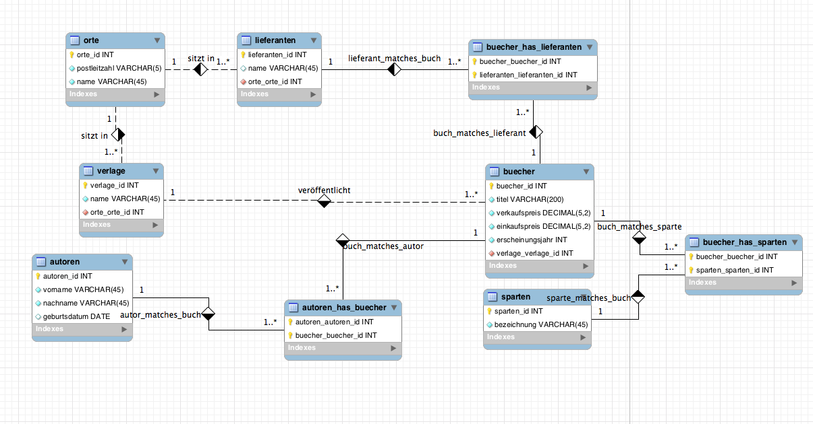

# SUBQUERY

Gegeben ist die Datenbank [buchladen](../Daten/buchladen.sql) sowie das ER-Diagramm:

In dieser Übung werden Subselects verwendet, die einen einzelnen, skalaren Wert zurückgeben. Manche Aufgaben könnten Sie auch auf andere (einfachere) Art und Weise erledigen, aber es geht hier darum, Subqueries zu üben und zu verwenden.

**Tipp**: Sie können für diesen Wert erst einmal einen beliebigen Wert annehmen, um die äußere Abfrage zu formulieren (... `WHERE einkaufspreis > 100`); dann ersetzen Sie diesen Wert (im Beispiel 100) durch eine `SELECT`-Abfrage, die den gewünschten Wert aus der Datenbank holt.

# Aufgaben

## Teil 1 (Skalare Subquery)

1.  Welches ist das teuerste Buch in der Datenbank?
2.  Welches ist das billigste Buch in der Datenbank?
3.  Lassen Sie sich alle Bücher ausgeben, deren Einkaufspreis über dem durchschnittlichen Einkaufspreis aller Bücher in der Datenbank liegt.
4.  Lassen Sie sich alle Bücher ausgeben, deren Einkaufspreis über dem durchschnittlichen Einkaufspreis der Thriller liegt.
5.  Lassen Sie sich alle Thriller ausgeben, deren Einkaufspreis über dem durchschnittlichen Einkaufspreis der Thriller liegt.
6.  Lassen Sie sich alle Bücher ausgeben, bei denen der Gewinn überdurchschnittlich ist; bei der Berechnung des Gewinndurchschnitts berücksichtigen Sie NICHT das Buch mit der id 22.

## Teil 2 (Subquery nach FROM)

1.  Wir brauchen die Summe der durchschnittlichen Einkaufspreise der einzelnen Sparten. Allerdings wollen wir dabei nicht die Sparte Humor berücksichtigen, ebenso wenig die Sparten, in denen der durchschnittliche Einkaufspreis 10 Euro oder weniger beträgt.

    **Tipp**: Erstellen Sie ein Subselect, dessen Ergebnis eine Tabelle ist, in der die gewünschten Sparten und ihre durchschnittlichen Einkaufspreise ausgegeben werden.

    Von dieser Tabelle fragen Sie anschließend die Summe ab.

2.  "Bekannte Autoren" definieren wir als Autoren, die mehr als 4 Bücher veröffentlicht haben. Wie viele solcher Autor/innen haben wir in der Datenbank?

    **Tipp**: Erstellen Sie ein Subselect, das Ihnen die bekannten Autoren ausgibt. Um zu sehen, ob Ihr Ergebnis plausibel wirkt, lassen Sie sich ausgeben: Vorname, Nachname, Anzahl veröffentlichter Büche.

    Über dieses Subselect machen Sie eine einfach COUNT-Abfrage.

3.  Ihr Chef sagt zu Ihnen: "Schauen Sie sich mal alle Verlage an, die im Durchschnitt weniger als 10 Euro Gewinn pro Buch machen. Ich glaube, die verdienen im Schnitt höchstens 7 Euro pro Buch."

    **Tipp**: Erstellen Sie für den ersten Satz des Chefs ein Subselect, das Sie für die Überprüfung des zweiten Satzes verwenden (Ausgabe: 'durchschnittlicher Gewinn pro Buch der Verlage, die weniger als 10 Euro pro Buch verdienen')
