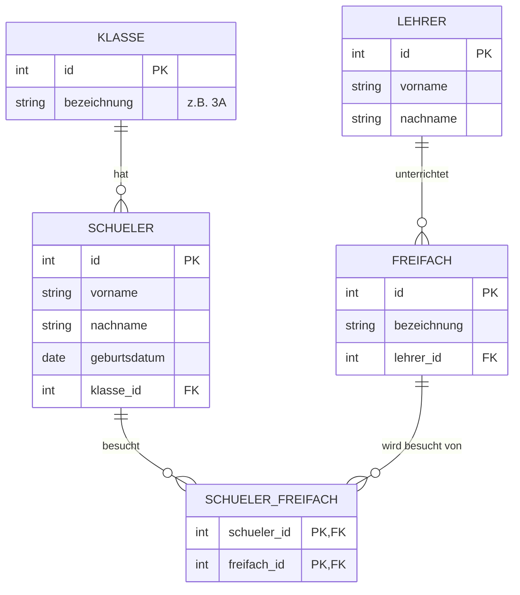
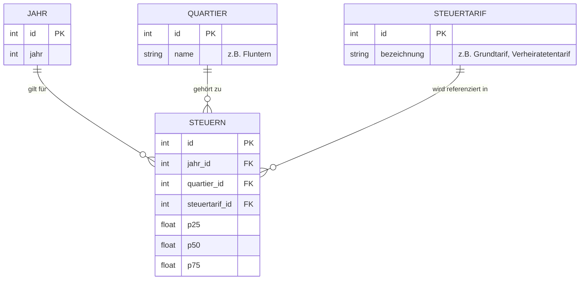

# ERD-Diagramme (Mermaid) für Tag 8 (Normalisierung)

## 1. Freifächer (Logisches / Physisches ERD)
Ausgangslage: Die unnormalisierte Excel-Tabelle musste in die 3. Normalform gebracht werden. Dies resultiert typischerweise in den Entitäten `Schueler`, `Klasse`, `Freifach`, `Lehrer` und der Zuordnungstabelle `Schueler_Freifach`.

## 2. Opendata Steuerdaten Stadt Zürich (Physisches ERD)
Ausgangslage: Aus einer flachen CSV-Datei mussten die redundanten Daten in ein relationales Modell überführt werden. Laut Lösungsdokument (`8T_Loes.md`) fließen diese Daten in vier Tabellen: `Jahr`, `Quartier`, `Steuertarif` und die Faktentabelle `Steuern`.

